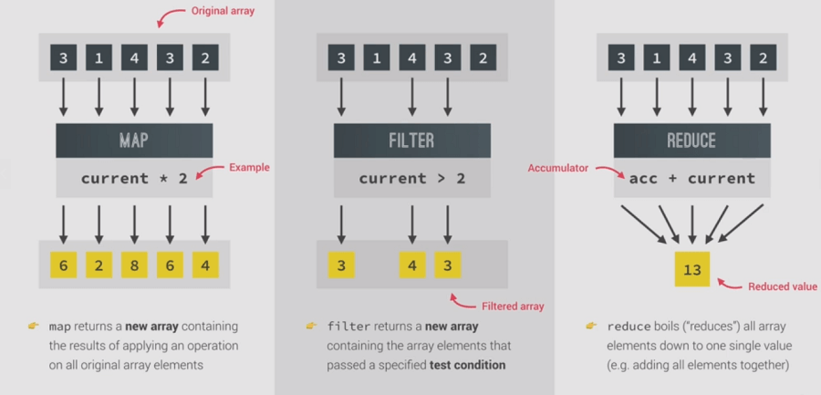

# Array Methods JS ES6

## Slice method

```js
const arr = ['a', 'b', 'c', 'd', 'e', 'f'];

console.log(arr.slice(2)); // ["c", "e", "f", "g"]
console.log(arr.slice(2, 4)); // ["c", "e"]
// Negative
console.log(arr.slice(-2)); // ["f", "g"]
// Everything except the first and the last one
console.log(arr.slice(1, -1)); // ["b", "c", "e", "f"]

// Creating a shallow copy of an array
// from prv. lessons, using spread operator
// const arrCpy = [...arr];
// Using slice
const arrCpy = arr.slice();
```

Use destructuring for individual cases, and use slice when used with other chaining methods

## Splice method

The splice is similar to slice but it changes the original array, (using the same array above)

```js
// console.log(arr.splice(2));
// console.log(arr); // ["a", "b"]
```

So splice changes the original array(destructive method), one common use case of this method is to delete elements from the array

```js
arr.splice(-1);
// the last element gone
console.log(arr); // ["a", "b", "c", "d", "e"]

// The second argument is the number of elements to be deleted starting from the index position
// Starting from position 1 remove 2 elements
const arrRes = arr.splice(1, 2);
console.log(arr); // ["a", "d", "e"]
console.log(arrRes); // ["b", "c"]
```

The third argument can be used to add elements in the specified position.

## reverse method

```js
const arr = ['a', 'b', 'c', 'd', 'e', 'f'];
const arr2 = ['j', 'k', 'l', 'm', 'n'];

console.log(arr2.reverse()); // ["n", "m", "l", "k", "j"]
// But the reverse method mutates the original one too
console.log(arr2); // ["n", "m", "l", "k", "j"]
```

## concat method

```js
const letters = arr.concat(arr2);
console.log(letters); // It joins the 2 arrays
// Similar one using the destructuring
console.log([...arr, ...arr2]);
```

## join method

```js
console.log(letters.join('-'));
// Joins each of them with a '-'
```

Remember the old ones push, pop ==> From last remove and add,\
                 shift, unshift ==> From first add and remove,

## The forEach Method

The array traversal method for modern JS.

The trans array is basically an account holders transactions

`const trans = [200, 450, -400, 3000, -650, -130, 70, 1300];`

```js
for (let i = 0; i < trans.length; i++) {
  if (trans[i] > 0) {
    console.log(`You deposited ${trans[i]}`);
  } else {
    console.log(`You withdrew ${Math.abs(trans[i])}`);
  }
}
```

```js
// Using forEach
trans.forEach((t, i, arr) => {
  if (t > 0) {
    console.log(`Movement ${i + 1}: You deposited ${t}`);
  } else {
    console.log(`Movement ${i + 1}: You withdrew ${Math.abs(t)}`);
  }
});
```

It is basically a function called for each iteration, so it must be relatively slower

can access them in order, (element, index, the array itself)

### forEach with maps and sets

```js
const currencies = new Map([
  ['USD', 'United States dollar'],
  ['EUR', 'Euro'],
  ['GBP', 'Pound sterling'],
  ['RS', 'Indian Rupee'],
]);

// Order is reversed in maps, it is value, key
currencies.forEach((value, key, map) => {
  console.log(map);
  console.log(key, value);
});

// with sets
const currenciesUnique = new Set(['USD', 'GBP', 'USD', 'EUR', 'RS']);

console.log(currenciesUnique);

currenciesUnique.forEach((item, index, set) => {
  console.log(item, index, set);
});

// But the result is
/*
USD USD Set(4){"USD", "GBP", "EUR", "RS"}
GBP GBP Set(4){"USD", "GBP", "EUR", "RS"}
EUR EUR Set(4){"USD", "GBP", "EUR", "RS"}
RS RS Set(4){"USD", "GBP", "EUR", "RS"}
*/
```

Shows that the sets don't got any indexes and index part is not omitted from the for loop in order to keep the for structure constant, so this will also do,

```js
currenciesUnique.forEach((item, _, set) => {
  console.log(item, set);
});
```

## MAP, FILTER & REDUCE

  

**map**

* map creates a brand new array based on the original array.
* It simply takes an array, loops through that array, in each iteration, applies a callback function and returns the newly created array.

**filter**

* filter the elements out from the original array that satisfies some conditions.
* Only elements with condition results true is added to the final array.

**reduce**

* reduces all array elements to one single value (eg: elements added together)
* There is an accumulator element at start, as it loops through the array, it adds the current element(or its modified form) to the accumulator, finally returns the accumulator.
* snowball that gets bigger and bigger as its rolls down the hill.

**practice**

### map method

* The movements array contain money transactions in US dollars

  `const movements = [200, 450, -400, 3000, -650, -130, 70, 1300];`

* lets convert dollars to indian rupees to display, todays rate is

  ```js
  // 1 USD is 73.64 INR
  const usdToInr = 73.64;
  ```

* use the map function to return a new array contains the converted values.

  ```js
  const movementsINR = movements.map(function (mov) {
    return mov * usdToInr;
  });
  ```

* using arrow fn. simplifies it a lot.

  ```js
  // const movementsINR = movements.map((val) => val * usdToInr);
  console.log(movementsINR);
  // [14728, 33138, -29456, 220920, -47866, -9573.2, 5154.8, 95732]
  ```

* map method also got access to the index and the whole array other than the current element.

  ```js
  const movementsSTR = movementsINR.map((val, i, arr) => {
    if (val > 0) {
      return `Movement ${i + 1}: You deposited ${val}`;
    }
    return `Movement ${i + 1}: You withdraw ${Math.abs(val)}`;
  });
  ```

  OR simplify it with turnery operator,

  ```js
  const movementsSTR = movementsINR.map(
    (val, i) =>
      `Movement ${i + 1}: You ${val > 0 ? 'deposited' : 'withdrawn'} ${Math.abs(
        val
      )}`
  );

  console.log(movementsSTR);
  ```

* The idea of side effects(A side effect is any application state change that is observable outside the called function other than its return value), incudes,
  * Modifying any external variable or object property (e.g., a global variable, or a variable in the parent function scope chain)
  * Logging to the console
  * Writing to the screen
  * Writing to a file
  * Writing to the network
  * Triggering any external process
  * Calling any other functions with side-effects
* using forEach to do this thing (to log it to the console in each iteration) causes side effects, in map the entire array after processing is logged at once, better functional code.

  learn more about [functional paradigm](https://medium.com/javascript-scene/master-the-javascript-interview-what-is-functional-programming-7f218c68b3a0) and side effects here.

* What you do need to know right now is that side-effect actions need to be isolated from the rest of your software. If you keep your side effects separate from the rest of your program logic, your software will be much easier to extend, refactor, debug, test, and maintain.

* A practical example that uses map chained with other methods,

  ```js
  // Compute username for each user

  // eg for 'Walter White' => ww, 'Jimmy Cliff' => 'jc'

  // This creates side effects
  const createUsername = function (accs) {
    // modifies each account to add a username
    accs.forEach((acc) => {
      // generate the username grabbing the first letters of names
      acc.username = acc.owner
        .toLowerCase()
        .split(' ')
        .map((n) => n[0])
        .join('');
    });
  };

  createUsername(accounts);

  accounts.forEach((acc) => {
    console.log(acc.username);
  });
  ```

* Also look in that altering the object passed to the function (modifying object property), that creates a side effect there.(need to be avoided in real functional programming), do a comment on the function  this creates side effects.

### filter method

* This filters out the elements from the array based on the condition given.

  ```js
  const movements = [200, 450, -400, 3000, -650, -130, 70, 1300];

  // Filter deposits(movements that are above zero)
  const deposit = movements.filter((trans) => trans > 0);

  console.log(deposit);
  // [200, 450, 3000, 70, 1300]

  // And for withdrawals
  const withdraw = movements.filter((trans) => trans < 0);
  console.log(withdraw);
  // [-400, -650, -130]
  ```

### reduce method

* reduce accepts a callback function and a return value(inital/accumulator), the return value gets modified in the call back function for every iteration, finally it gets returned.

* The call back function accepts up to 4 arguments(**previous value**, **current value**, current index, whole array), previous value is nothing but the modified return value of each preceding iteration(the accumulator), ie for the first iteration it is the initial one given.\
current value is the current element from the array,
* The previous value, current value and the initial return value are mandatory to run a reduce method.
* In the sum example, in each iteration the current value gets added to the previous value, and the final value (ie the sum) gets returned at the end of the iteration.

  ```js
  // Using reduce lets add up all the elements in the movements array.
  const movements = [200, 450, -400, 3000, -650, -130, 70, 1300];

  const total = movements.reduce((accu, curr, i) => {
    console.log(`Iteration ${i + 1}: ${accu} + ${curr}`);
    return accu + curr;
  }, 0);
  console.log(total);

  /*
  Iteration 1: 0 + 200
  Iteration 2: 200 + 450
  Iteration 3: 650 + -400
  Iteration 4: 250 + 3000
  Iteration 5: 3250 + -650
  Iteration 6: 2600 + -130
  Iteration 7: 2470 + 70
  Iteration 8: 2540 + 1300
  3840
  */
  ```

* It can be visualized as a snowball(our initial accumulator), getting bigger and bigger, on each roll.
* Finding the max. value of that array using reduce method.

  ```js
  // reduce to maximum value
  const maxValue = movements.reduce((a, c) => (a > c ? a : c), movements[0]);
  console.log(maxValue);
  ```

*