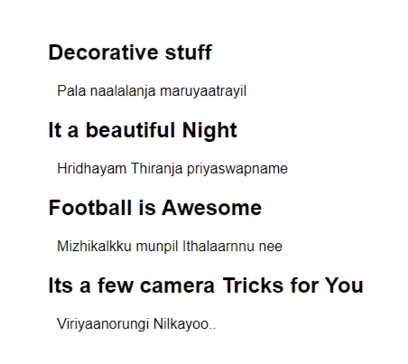
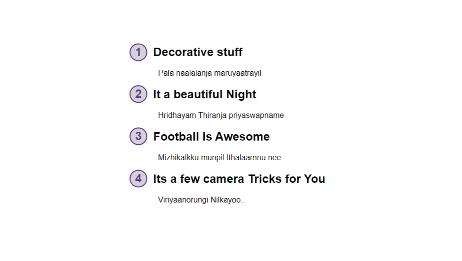
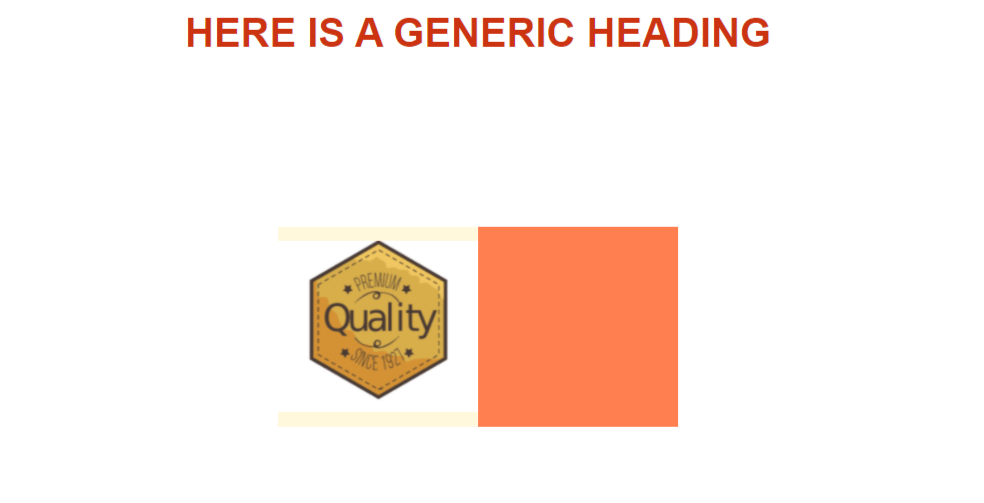
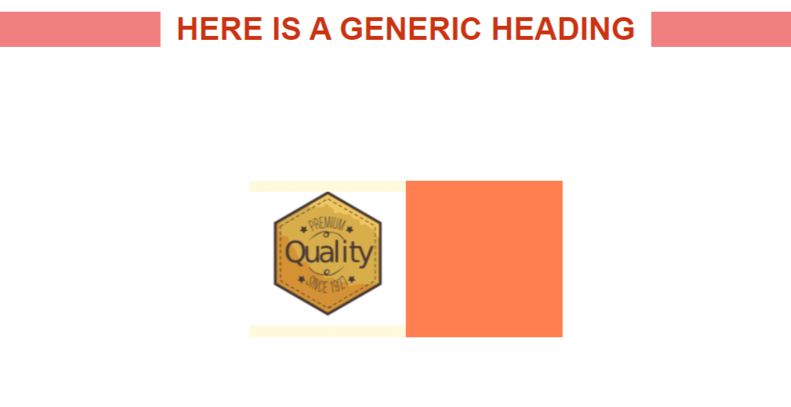

# CSS ::Before and ::After pseudo elements
---

There are pseudo classes(:hover, :active) and pseudo elements in CSS.\
Going to use an example of a \<p> element to study it.
```html
<body>
    <p>This is just a paragraph</p>
</body>
```
And css/
```css
p{
    font-family: sans-serif;
    font-size: 30px;
    position: absolute;
    top: 50%;
    left:50%;
    transform: translate(-50%, -50%);
}
```


If added the pseudo before class,

```css
p::before{
    background: red;
    width: 10px;
    height: 10px;
    display: block;
    position: absolute;
    top: 0;
    bottom: 0;
}
```
***Nothing happens***, cz it need a `content` to add styles, ie just add a blank
string content.
```css
p::before{
    content: '';
    background: red;
    width: 10px;
    height: 10px;
    display: block;
    position: absolute;
    top: 0;
    bottom: 0;
}
```
Then the read block appears, it is added in the `<p>` element just before the content.\
that can be seen in the console a `::before` class gets added,

If an after element is added (with same styles),it is going to overlap with the first before
element with present settings, but if the parent container is `flexbox` then, it comes after
the `<p>` element.

```css
p::after{
    content: '';
    background: red;
    width: 10px;
    height: 10px;
    display: block;
    position: absolute;
    top: 35px;
}
```


It is important to note that the elements (::before/ ::after), is gonna get added to the content
of the chosen element,

**IMP** : The `` tags are special, they don't contain anything (it itself is a content with
a `src=""` attribute), so the pseudo elements don't work with it.

To add extra text (don't recommended usually..), use the `content:'<text>'`, (change the `display: block`),
or to add extra `inline` or `inline block`. The pseudo elements are `inline` by default.

It can be used to add images.\
`content: url(".....")`


But to use the feature productively, this is an example, if there is so many quotes in your html,
with class quotes, one can add quotes("") to them without hard-coding anything.

```html
<p class="quote">Everything is changing, the only one without a change is change itself.</p>
```
```css
.quote::before{
    content: open-quote;
}

.quote::after{
    content: close-quote;
}
```
One can change the `font-size`, color or any possible property..to customize it.

## Applications

1. ### Hover over to get more information

   Here is an anchor tag with some information embedded, (mainly done for use in js)
   ```html
     <ul>
        <li><p>Lorem oombam<a href="#" tips="Any tip is a good tip"> Tips</a></p></li>
        <li></li>
        <li></li>
    </ul>
   ```

   ```css
   a[tips]{
       position: relative;
   }

   a[tips]::after{
       content: attr(tips);
       /* The attribute content will appear after this */
       display: block;
       position: absolute;
       background-color: rgba(149, 172, 241, 0.562);
       padding: 1em 3em;
       color: rgb(29, 13, 1);
       border-radius: 5px;
       font-size: 0.8em;
       bottom: 100%;
       left: 0;
       /* To hold off the wrapping (in a single line-box)*/
       white-space: nowrap;
   }
   ```
   That gives,
   

    To make it only show up when the mouse is over.
    ```css
   a[tips]::after{
       transform: scale(0);
       /* To give it the growing animation */
       transition: transform ease-out 150ms;
   }

   a[tips]:hover::after{
        transform: scale(1);
    }
   ```
    Now, it gets some kind of growing animation but it is not from the correct position, add
    one more transform to make that correct.
    ```css
   a[tips]::after{
       bottom: 0%;
       left: -150px;
       transform: scale(0);
       transition:
         transform ease-out 150ms,
         bottom ease-in 150ms;
   }

   a[tips]:hover::after{
        transform: scale(1);
        bottom: 100%;
    }
   ```

2. ### Links with custom icons

    If there need some icons needed to be added with the link, just use `font-awesome` icons in the
    content

    ```css
    /* Any thing that starts with http */
    a[href^="http"]::after{
        font-family: 'Font Awesome 5 Free';
        /* Add the content from the Font awesome datasheet */
        content: '\f35d';
        font-weight: 900;
        font-size: 0.8em;
    }
    ```
3. ### Adding counters

    > CSS counters are "variables" maintained by CSS whose values can be incremented by CSS rules (to track how many times they are used). Counters let you adjust the appearance of content based on its placement in the document.

    * counter-reset - Creates or resets a counter
    * counter-increment - Increments a counter value
    * content - Inserts generated content
    * counter() or counters() function - Adds the value of a counter to an element

    To use a CSS counter, it must first be created with counter-reset.

    Let it use to number the sections in the following html

    ```html
    <h1>Using CSS Counters:</h1>
    <h2>HTML Tutorial</h2>
    <h2>CSS Tutorial</h2>
    <h2>JavaScript Tutorial</h2>
    ```
    It creates a counter for the page (in the body selector), then increments the counter value for each \<h2> element and adds "Section <value of the counter>:" to the beginning of each \<h2> element:
    ```css
    body {
        counter-reset: section;
    }

    h2::before {
        counter-increment: section;
        content: "Section " counter(section) ": ";
    }
    ```

    Also it can be used to create subsections.
    ```css
      body {
        counter-reset: section;
      }

      h1 {
        counter-reset: subsection;
      }

      h1::before {
        counter-increment: section;
        content: "Section " counter(section) ". ";
      }

      h2::before {
        counter-increment: subsection;
        content: counter(section) "." counter(subsection) " ";
      }
    ```
    look [here](https://www.w3schools.com/css/tryit.asp?filename=trycss_counters2) for the results.

    Ie, for our example.\
    make a series of headings and paragraphs.
    ```html
    <body>
    <div class="counters">
        <h2>Decorative stuff</h2>
        <p>Pala naalalanja maruyaatrayil</p>
        <h2>It a beautiful Night</h2>
        <p>Hridhayam Thiranja priyaswapname</p>
        <h2>Football is Awesome</h2>
        <p>Mizhikalkku munpil Ithalaarnnu nee</p>
        <h2>Its a few camera Tricks for You</h2>
        <p>Viriyaanorungi Nilkayoo..</p>
    </div>
    </body>
    ```
    ```css
    body{
    height: 100vh;
    font-family: sans-serif;
   }

   .counters{
       position: absolute;
       top: 50%;
       left: 50%;
       transform: translate(-50%, -50%);
   }

   p{
       margin-left: 10px;
   }
   ```
   

    Do the counter stuff..
    ```css
      .counters{
      /* There need to give the counter a name */
      /* counter-reset indicates the counter resets every time encounters a new element */
      counter-reset: random-text;
      }

      h2{
          position: relative;
      }

      h2::before{
          /* Every time it gets to an h2 its gonna increment */
          counter-increment: random-text;
          content: counter(random-text);
          position: absolute;
          left: -2.0em;
          top: -0.2em;
          background: lightgray;
          width: 1.5em;
          height: 1.5em;
          /* Put the number in center */
          display: flex;
          justify-content: center;
          align-items: center;

          /* Make it into a circle */
          border-radius: 50%;
          border: 2px solid rebeccapurple;
          /* To not include the borders with in the width and height */
          box-sizing: border-box;
          color: rebeccapurple;
      }
    ```
    

    It can be utilized for many things to alter the styling of ordered lists,
    ```css
    .counters ol{
        counter-reset: ol-numbering;
        /* Turn off the original styles */
        list-style: none;
    }

    .counters li::before{
        counter-increment: ol-numbering;
        content: 'list item ' counter(ol-numbering) ') ';
    }
    ```

4. ### Hover Effects using Pseudo Elements

    ***NOTE***: use box-sizing: border box in all pseudo elements to avoid extra headache's\
    `*, *::before, *::after { box-sizing: border-box; }`\
    The universal selector ("*") doesn't includes the before and after styles
    need to add them separately

    ***Using Sass fot the styling***
    (for better nesting and things)

    The basic html consist of a heading h1, and two images aligned with flexbox\
    ```html
    <h1 class="main-heading">HERE IS A GENERIC HEADING</h1>
    <div class="img-deco">
        <div class="main-img"></div>
        <div class="main-div"></div>
    </div>
    ```
    The sass file,
    ```scss
      *, *::before, *::after{
       box-sizing: border-box;
      }

      body{
          height: 100vh;
          font-family: sans-serif;
          text-align: center;
      }

      h1{
          font-size: 2.5rem;
          text-align: center;
          text-transform: uppercase;
          color: #c31;
          margin-top: 1.5rem;
      }

      .main-heading{
          position: relative;
          display: inline-block;
      }

      .img-deco{
          position: absolute;
          top: 50%;
          left: 50%;
          transform: translate(-50%, -50%);
          display: flex;
          justify-content: space-between;
          align-items: center;
      }

      .main-img{
          width: 200px;
          height: 200px;
          background: cornsilk;
          display: flex;

          img{
          width: 200px;
          height: auto;
          align-self: center;
          }
      }

      .main-div{
          width: 200px;
          height: 200px;
          background: coral;
      }
    ```
    

    To add  custom line-highted block on the left and right of the heading,
    use the css pseudo elements,
    ```scss
    .main-heading{
    position: relative;
    display: inline-block;

       &::before,
       &::after{
           content: '';
           height: 100%;
           display: block;
           position: absolute;
       }

       &::before{
           background: white;
           // width: 100%;
           z-index: -1;
           left: -20px;
           right: -20px;
       }

       &::after{
           background: lightcoral;
           width: 100vw;
           left: 50%;
           top: 0;
           // Moved up the after element.
           transform: translateX(-50%);
           z-index: -2;
       }
    }
    ```
    That gives the, underlying effect to the text, without any markup, an self adjusted with the text,
    

    There is beautiful practical, image hover effect that is done with this pseudo elements, go checkout,
    the html and css files with the notes for it.