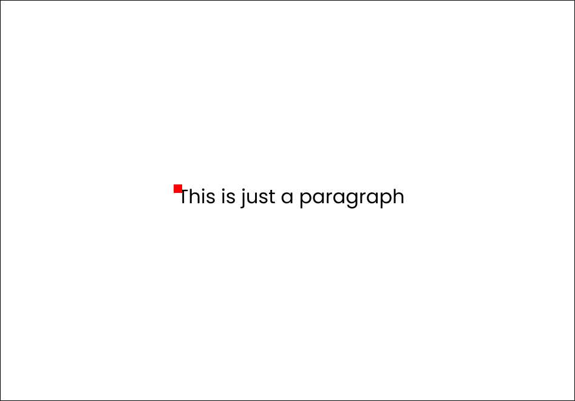
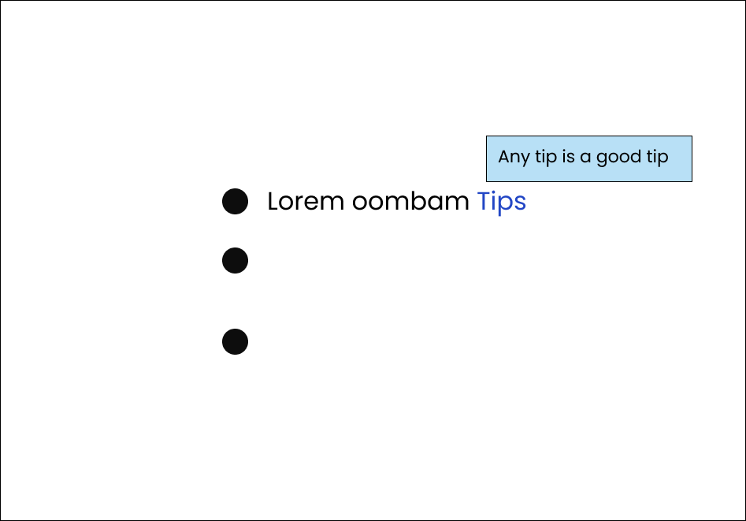

# CSS ::Before and ::After pseudo elements
---

There are pseudo classes(:hover, :active) and pseudo elements in CSS.\
Going to use an example of a \<p> element to study it.
```html
<body>
    <p>This is just a paragraph</p>
</body>
```
And css/
```css
p{
    font-family: sans-serif;
    font-size: 30px;
    position: absolute;
    top: 50%;
    left:50%;
    transform: translate(-50%, -50%);
}
```


If added the pseudo before class,

```css
p::before{
    background: red;
    width: 10px;
    height: 10px;
    display: block;
    position: absolute;
    top: 0;
    bottom: 0;
}
```
***Nothing happens***, cz it need a `content` to add styles, ie just add a blank
string content.
```css
p::before{
    content: '';
    background: red;
    width: 10px;
    height: 10px;
    display: block;
    position: absolute;
    top: 0;
    bottom: 0;
}
```
Then the read block appears, it is added in the `<p>` element just before the content.\
that can be seen in the console a `::before` class gets added,

If an after element is added (with same styles),it is going to overlap with the first before
element with present settings, but if the parent container is `flexbox` then, it comes after
the `<p>` element.

```css
p::after{
    content: '';
    background: red;
    width: 10px;
    height: 10px;
    display: block;
    position: absolute;
    top: 35px;
}
```


It is important to note that the elements (::before/ ::after), is gonna get added to the content
of the chosen element,

**IMP** : The `` tags are special, they don't contain anything (it itself is a content with
a `src=""` attribute), so the pseudo elements don't work with it.

To add extra text (don't recommended usually..), use the `content:'<text>'`, (change the `display: block`),
or to add extra `inline` or `inline block`. The pseudo elements are `inline` by default.

It can be used to add images.\
`content: url(".....")`


But to use the feature productively, this is an example, if there is so many quotes in your html,
with class quotes, one can add quotes("") to them without hard-coding anything.

```html
<p class="quote">Everything is changing, the only one without a change is change itself.</p>
```
```css
.quote::before{
    content: open-quote;
}

.quote::after{
    content: close-quote;
}
```
One can change the `font-size`, color or any possible property..to customize it.

## Applications

1. ### Hover over to get more information

   Here is an anchor tag with some information embedded, (mainly done for use in js)
   ```html
     <ul>
        <li><p>Lorem oombam<a href="#" tips="Any tip is a good tip"> Tips</a></p></li>
        <li></li>
        <li></li>
    </ul>
   ```

   ```css
   a[tips]{
       position: relative;
   }

   a[tips]::after{
       content: attr(tips);
       /* The attribute content will appear after this */
       display: block;
       position: absolute;
       background-color: rgba(149, 172, 241, 0.562);
       padding: 1em 3em;
       color: rgb(29, 13, 1);
       border-radius: 5px;
       font-size: 0.8em;
       bottom: 100%;
       left: 0;
       /* To hold off the wrapping (in a single line-box)*/
       white-space: nowrap;
   }
   ```
   That gives,
   

    To make it only show up when the mouse is over.
    ```css
   a[tips]::after{
       transform: scale(0);
       /* To give it the growing animation */
       transition: transform ease-out 150ms;
   }

   a[tips]:hover::after{
        transform: scale(1);
    }
   ```
    Now, it gets some kind of growing animation but it is not from the correct position, add
    one more transform to make that correct.
    ```css
   a[tips]::after{
       bottom: 0%;
       left: -150px;
       transform: scale(0);
       transition:
         transform ease-out 150ms,
         bottom ease-in 150ms;
   }

   a[tips]:hover::after{
        transform: scale(1);
        bottom: 100%;
    }
   ```

2. ### Links with custom icons

    If there need some icons needed to be added with the link, just use `font-awesome` icons in the
    content

    ```css
    /* Any thing that starts with http */
    a[href^="http"]::after{
        font-family: 'Font Awesome 5 Free';
        /* Add the content from the Font awesome datasheet */
        content: '\f35d';
        font-weight: 900;
        font-size: 0.8em;
    }
    ```