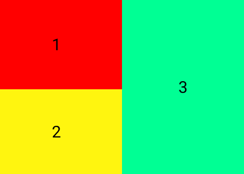
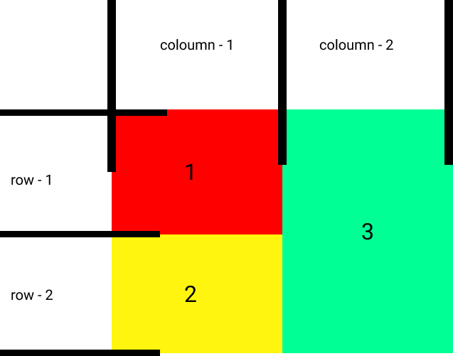
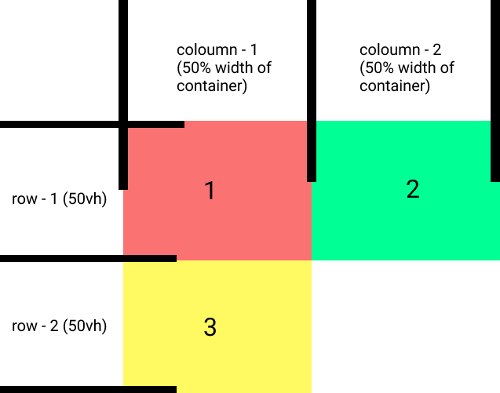
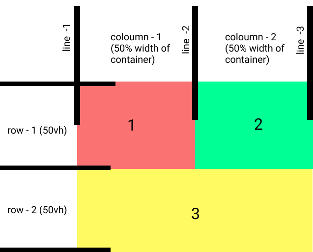
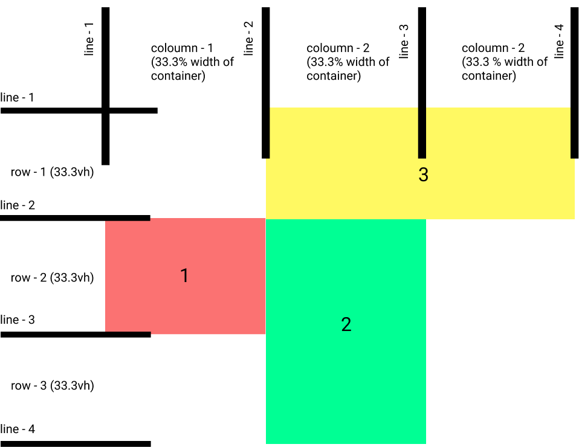
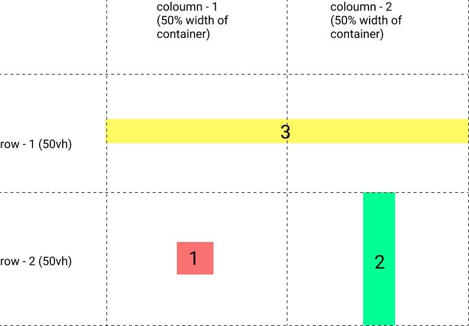

# **CSS GRID - NOTES**
---

For more complex layouts, the css Flex-box itself, cannot handle them all
For eg,


<!--  -->


Like there are 4 \<div> tags 3 needed to be aligned at the top and one at the bottom. We need more\
extra divs to wrp the top ones that makes things more complex./
or a design like these, need to more mess around with those divs.




With CSS grid, in the CSS of the man container, change the `display: grid;`\
It creates a row - column layout like this,



Specify this using `grid-template-columns: ` property, a "`grid-template-columns: 300px 300px;`", means
2 columns with width 300px each.

One can also use "percentages" and "fractions" in place of pixels to specify the column width, like
`1 fr` = all the space available,\


eg: `grid-template-columns: 300px 300px;` (for three divs)\
the first two containers takes up 300px each and the third one takes all the remaining space.\
another, `grid-template-columns: 1fr 1fr 1fr;`\


The available space equally divided in to three spaces and each div takes one space(or simply each\
div get assigned to "1/3" of total available space, that is what fractions are)\
again, in `grid-template-columns: 1fr 2fr 1fr;`\
The space distribution: - 1/4, 2/4, 1/4.

For defining the width of a row, use the `grid-template-rows: ;` property,\
Eg:
```css
main{
    display: grid;
    height: 100vh;
    /* Amount of area a column need */
    grid-template-columns: 1fr 1fr;
    /* Each row height 50vh */
    grid-template-rows: 1fr 1 fr;
}
```


To stretch the bottom one(3) to fit the whole container, one way to do is by selecting\
the div,
```css
.box3{
    grid-column-start: 1;
    grid-column-end: 3;
}
```


Or, in a shorter way just using, `grid-column: 1/3;`

Similarly for row,(to stretch box-2 to down, befor it is needed to fix the other boxes, or
the 2nd one shifts to 1st column.)
```css
.box1{
    grid-column: 1/2;
    grid-row: 1/2;
}

.box2{
    grid-row: 1/3;
}
```


More complex designs can be achieved like, with
```css
main{
    display: grid;
    height: 100vh;
    /* Amount of area a column need */
    grid-template-columns: 1fr 1fr 1fr;
    grid-template-rows: 1fr 1fr 1fr;
}

.box1{
    grid-column: 1/2;
    grid-row: 2/3;
}

.box2{
    grid-column: 2/3;
    grid-row: 2/4;
}

.box3{
    grid-column: 2/4;
    grid-row: 1/2;
}
```


### CSS GRID using `grid-template-areas`

Without counting the starting and ending lines, the grid layout can be represented in a more/
visual form using, `grid-template-areas:`, To get the same results as above example.
```css
main{
    display: grid;
    height: 100vh;
    /* Amount of area a column need */
    grid-template-columns: 1fr 1fr 1fr;
    grid-template-rows: 1fr 1fr 1fr;
    grid-template-areas:
        ". b3 b3"
        "b1 b2 ."
        ". b2 .";
}

/* Give Each of the boxes a name, that name is used in "grid-template-areas:" */
.box1{
    grid-area: b1;
}

.box2{
    grid-area: b2;
}

.box3{
    grid-area: b3;
}
```
Each quotes ("") represent a row and each element represent column divisions in that row,\
the elements can be given a user defined name using `grid-area` as shown, add dots `.` for\
denoting an empty space.


To align items inside each boxes *horizontally*, can use `justify-items` in the `main` container\
it got properties, `center, end, start, stretch(default)`

Similarly to align items *vertically*, there is `align-items` property with same options
`center, start....`

To align individual items, use `align-self` property - for *vertical*, The options are same but it only affects
that individual element, also with the `justify-self` property align *horizontally*.
```css
main{
    display: grid;
    height: 100vh;
    /* Amount of area a column need */
    grid-template-columns: 1fr 1fr;
    grid-template-rows: 1fr 1fr;
    grid-template-areas: "b3 b3"
                         "b1 b2";
    justify-items: center;
    align-items: center;
}

/* Give Each of the boxes a name, that name is used in "grid-template-areas:" */
.box1{
    grid-area: b1;
}

.box2{
    grid-area: b2;
    align-self: stretch;
}

.box3{
    grid-area: b3;
    justify-self: stretch;
}
```


combine this css-grid with flex-box to get to the desired results.

Instead of repeating the values use,\
`grid-template-columns: 300px 300px 300px;`\
`grid-template-columns: repeat(3, 300px);`

To make it responsive more, instead of giving the number use `auto-fill`\
`grid-template-columns: repeat(auto-fill, 300px);`\
Then it will calculate how many `300px` columns can fit in the given display port area\
and adjusts it accordingly. So it can automatically fill the entire area with the given
boxes.

If there is few contents to fit to the column, css grid generates this empty box, which is to
fill that area, if we don't need that can use `auto-fit`.\
`grid-template-columns: repeat(auto-fit, 300px);`\

If we don't need to stuck with the 300px value of an image, can specify a minimum and maximum
size of a box using `minmax` property,\
`grid-template-columns: repeat(auto-fit, minmax(300px, 1fr));`\
the boxes(used often for responsive galleries) gonna stick and fit the entire container with the min
and max values,


To add gap between columns,
> CSS Grid Layout initially defined the grid-column-gap property. This prefixed property is being replaced by column-gap. However, in order to support browsers that implemented grid-column-gap and not column-gap for grid, you will need to use the prefixed property.

Use those `grid-column-gap` and `grid-row-gap`, and get some bloody GAPS mannn....

All together for a `div` with `class="gallery"`, that contains images, the following gonna bring
out a responsive gallery, so U can browse those on mac-book pro to i pad to redmi note 9 to nokia xpressmusic
all same....
```css
.gallery{
    display: grid;
    grid-template-columns: repeat(auto-fit, minmax(300px, 1fr));
    grid-column-gap: 20px;
    grid-row-gap: 20px;
}

.gallery img{
    width: 100%;
}
```
