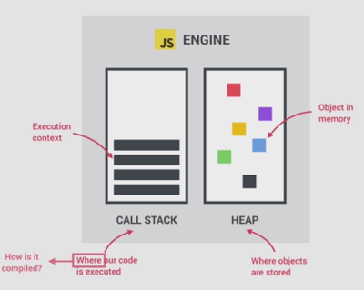
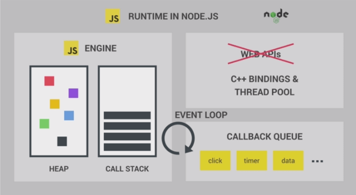

# How JS Works

---

:: images from jonas udemy course :+1:

## Javascript Engine

---

Program that executes JS codes, most popular one now is googles V8 engine- that powers chrome and the node.js

* ### Components of JS Engine

    ---

    

    ***Call-stack***:- All the the processes are called and executed based on the execution context.
    ***Heap***: - Unstructured memory pool that stores all the objects.

* ### Compilation vs Interpretation

    ---
    ***Compilation***: Entire code is converted into machine code at once, and written to a binary file that can be executed by a computer.(as in C)\
    Here execution can happen way after compilation.

    

    ***Interpretation***: There is an interpreter runs through the source code and executes it line by line.
    ie, read and executed at the same time.

    

    The conversion to machine code happens before the execution,\
    JS is an purely Interpreted language (like python), they are much slower than compiled languages,

    But as the JS evolves, the modern JS used to create web apps that can be matched with native apps,
    here low performance is no longer acceptable.

    > The modern JS engines uses a mix between compilation and interpretation, or in time compilation

    ***JIT(Just-in-time) compilation***: - Entire code is converted into machine code at once, then executed immediately.

    

    There is portable files and the execution happens immediately.

* ### Just-In_Time(JIT) compilation of Javascript

    ---
    *Parsing the code*:- The code is parsed to an AST(Abstract Syntax Tree), it collect the pieces from code and structure it in an executable way, also checks if there is any syntax errors, the resulting tree later used to generate machine code.

    For Eg: The AST for just a variable declaration looks like this,

    

    This tree got nothing to do with DOM.

    compiling the code: -  That takes the AST and compiles it to machine code.
    Execution:- Execution happens just after the compilation (happens in the call stack)

    But there is more..

    Optimization: - JS engine creates the first compiled machine code as fast as to get things run quickly(very un-optimized version), as execution succeeds it recomposes(optimization + recompiling) it time to time to create a more optimized version, without stopping execution..\
    That makes the modern JS engines so fast, these process happens in special threads that can't be accessed from code.(main thread is executing the call stack or does the main execution.)

    

    So never say JS is an Interpreted language anymore!

* ### Runtime In the Browser

    ---

    The most common javascript runtime is a browser, the heart of all runtime is a javascript engine.\
    But the engine itself is not enough to run a web application, there also needs WEB APIs.\
    WEB APIs are functionalities provided to the engine, which are not a direct part of javascript.\
    JS gets the access to this APIs through the global window object.

    But considering it all in a box that is the runtime, a box that contains all the JS related stuffs.

    A typical JS runtime also includes a **Callback Queue**. It is a data structure that contains all the callback functions that are ready to be executed(Event handler functions are also call back functions).

    The event loop takes functions from the queue and puts in the call stack.

    Refer:- This note to get the details.

    The event loop is the key part that makes JS non-blocking.

    

    JS also exists outside the browsers (node.js), the node.js runtime will look like this.

    

    But instead of web APIs (that are provided by the browser) there is C++ bindings and Thread Pool.

## Deeper into JS execution

---

* ### Execution Context

    ---

    We got the code after all the compilation, now it needs to be executed in the call stack.\
    For the top level code a global execution context is created. That is basically the code which are not inside any function.

    (Functions should be executed only when they are called.), for example the following snippet the name declaration is a top level code.

    ```javascript
    const name = "Akshay"; // Execution happens at top level

    const first = () => {  // declared in top level
        let a = 1;
        const b = second();
        a = a + b
        return a;
    };

    function second() {  // declared in top level
        var c = 2;
        return c;
    }
    ```

    Next there is two function (note that one is declaration and one is expression), they are declared already before execution, but only executed when they are called.

    > Execution context:- Environment in which a piece of Javascript is executed. Stores all the necessary information for some code to be executed.

    The info. contains local variables, arguments passed to a fun., in all large codes there is only one level of global execution context, which is default for the codes that is not inside any function (top-level).

    

    Execution: - The CPU processes the compiled machine code received.

    After the Global execution context finishes, Execution of functions and waiting for callbacks started. **One execution context created per function call**, containing all the info. necessary to run that function.

* #### Whats inside execution context

  1. **Variable Environment**
     * declarations (`let`, `const` and `var` declarations)
     * functions
     * arguments objects (arguments passed to object)

  2. **Scope Chain**
     * Scope chain consist of references to variables that are located outside of the current function.
     * It is stored in execution context.

  3. **`this` keyword**
     * The 'this' refers to the object itself in JS.

    The contents of the execution context (VE, Scope Chain, `this`), all generated in the creation phase right before execution.

    *note*: Execution context belong to **Arrow function** do not get their own arguments object nor the `this` keyword, they get it from their closest regular function parent.
