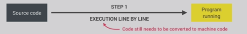
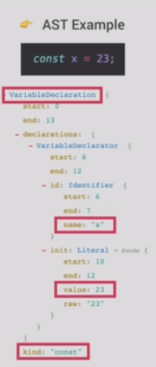
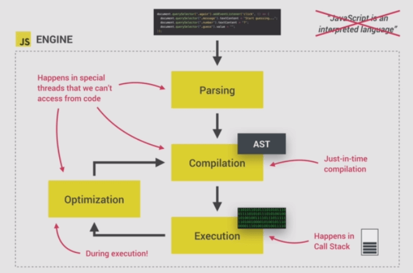
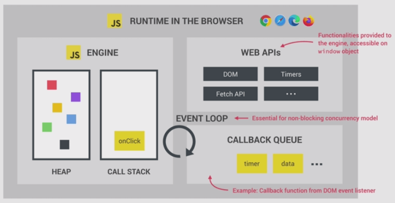

# How JS Works

---

:: images from jonas udemy course :+1:

## Javascript Engine

---

Program that executes JS codes, most popular one now is googles V8 engine- that powers chrome and the node.js

* ### Components of JS Engine

    ---

    

    ***Call-stack***:- All the the processes are called and executed based on the execution context.
    ***Heap***: - Unstructured memory pool that stores all the objects.

* ### Compilation vs Interpretation

    ---
    ***Compilation***: Entire code is converted into machine code at once, and written to a binary file that can be executed by a computer.(as in C)\
    Here execution can happen way after compilation.

    

    ***Interpretation***: There is an interpreter runs through the source code and executes it line by line.
    ie, read and executed at the same time.

    

    The conversion to machine code happens before the execution,\
    JS is an purely Interpreted language (like python), they are much slower than compiled languages,

    But as the JS evolves, the modern JS used to create web apps that can be matched with native apps,
    here low performance is no longer acceptable.

    > The modern JS engines uses a mix between compilation and interpretation, or in time compilation

    ***JIT(Just-in-time) compilation***: - Entire code is converted into machine code at once, then executed immediately.

    

    There is portable files and the execution happens immediately.

* ### Just-In_Time(JIT) compilation of Javascript

    ---
    *Parsing the code*:- The code is parsed to an AST(Abstract Syntax Tree), it collect the pieces from code and structure it in an executable way, also checks if there is any syntax errors, the resulting tree later used to generate machine code.

    For Eg: The AST for just a variable declaration looks like this,

    

    This tree got nothing to do with DOM.

    compiling the code: -  That takes the AST and compiles it to machine code.
    Execution:- Execution happens just after the compilation (happens in the call stack)

    But there is more..

    Optimization: - JS engine creates the first compiled machine code as fast as to get things run quickly(very un-optimized version), as execution succeeds it recomposes(optimization + recompiling) it time to time to create a more optimized version, without stopping execution..\
    That makes the modern JS engines so fast, these process happens in special threads that can't be accessed from code.(main thread is executing the call stack or does the main execution.)

    

    So never say JS is an Interpreted language anymore!

* ### Runtime In the Browser

    ---

    The most common javascript runtime is a browser, the heart of all runtime is a javascript engine.\
    But the engine itself is not enough to run a web application, there also needs WEB APIs.\
    WEB APIs are functionalities provided to the engine, which are not a direct part of javascript.\
    JS gets the access to this APIs through the global window object.

    But considering it all in a box that is the runtime, a box that contains all the JS related stuffs.

    A typical JS runtime also includes a **Callback Queue**. It is a data structure that contains all the callback functions that are ready to be executed(Event handler functions are also call back functions).

    The event loop takes functions from the queue and puts in the call stack.

    Refer:- This note to get the details.

    The event loop is the key part that makes JS non-blocking.

    

    JS also exists outside the browsers (node.js), the node.js runtime will look like this.

    

    But instead of web APIs (that are provided by the browser) there is C++ bindings and Thread Pool.

## Deeper into JS execution

---

* ### Execution Context

    ---

    We got the code after all the compilation, now it needs to be executed in the call stack.\
    For the top level code a global execution context is created. That is basically the code which are not inside any function.

    (Functions should be executed only when they are called.), for example the following snippet the name declaration is a top level code.

    ```javascript
    const name = "Akshay"; // Execution happens at top level

    const first = () => {  // declared in top level
        let a = 1;
        const b = second();
        a = a + b
        return a;
    };

    function second() {  // declared in top level
        var c = 2;
        return c;
    }
    ```

    Next there is two function (note that one is declaration and one is expression), they are declared already before execution, but only executed when they are called.

    > Execution context:- Environment in which a piece of Javascript is executed. Stores all the necessary information for some code to be executed.

    The info. contains local variables, arguments passed to a fun., in all large codes there is only one level of global execution context, which is default for the codes that is not inside any function (top-level).

    

    Execution: - The CPU processes the compiled machine code received.

    After the Global execution context finishes, Execution of functions and waiting for callbacks started. **One execution context created per function call**, containing all the info. necessary to run that function.

* ### Whats inside execution context

  1. **Variable Environment**
     * declarations (`let`, `const` and `var` declarations)
     * functions
     * arguments objects (arguments passed to object)

  2. **Scope Chain**
     * Scope chain consist of references to variables that are located outside of the current function.
     * It is stored in execution context.

  3. **`this` keyword**
     * The 'this' refers to the object itself in JS.

    The contents of the execution context (VE, Scope Chain, `this`), all generated in the creation phase right before execution.

    *note*: Execution context belong to **Arrow function** do not get their own arguments object nor the `this` keyword, they get it from their closest regular function parent.

    For the code example,

    The global execution context for this code contain, the name first and second function declarations, and also the 'x'. note, that some values are 'unknown' yet.\
    In first() function ex. context, a is set to 1 and b - unknown\
    The second() fun. ex. context, c = 2 and arguments also caught cz it is a regular function

    

* ### Call Stack

  ---

  It keeps track where is the program execution now, it is a stack of execution contexts, the ex. context in the top of the stack is the one ie. currently running.

  1. The first thing happens is the creation of **Global execution context** (for every program ie even a single log statement), then it is put to the **call stack**, now it is in the top and the one to be executed..
  2. The execution of global ex. context happens, when it meets function `first()` call, it creates an execution context for that function now it is in top and starts to execute.
  3. In the `first()` function, variable `a` abd `b` are defined on the variable environment of current ex. context, when const `b` is acquired, it meets the `second ()` fun. and creates an ex. context for it, with the arguments, it is in top and runs..while the execution of the `first()` situated below the stack, is now paused. Remember *Javascript by far can do only single thread operations*.
  4. Now the `second()` fn. runs, it is closed when `return` occur, then back to first at last the global context.. then it stays here until the program eventually get closed, ie for a browser closing a web page, completing the program execution.

    

  With out the call stack the execution cannot know where to go back or what to execute after, call stack is the map/thing that guides the JS engine.

## Scoping and Scope in Javascript: concepts

  ---

  ***Scoping***:- Scoping simply answers the question, where one can access a certain variable or function.

  In JS each function creates a scope, and JS got lexical scoping.

  ***Lexical Scoping***: - Its about the range of accessibility or how a variable is going to be fetched in JS, or the scoping is controlled by placement of functions and blocks in the code (remember in python, there is LEGB rule (Local -> Enclosed -> Global -> Built in)),\
  simply functions inside a function got access to the variables of parent function.

  ***Scope***:- Scope is a space/environment in which the variables it defined are accessible, there is *global scope*, *function scope* and *block scope*.

  ***scope of a variable***: - Region of our code where a certain variable can be accessed.

  (generally for all the word above it is referred 'scope', use the brain to change it accordingly with what it actually is.)

  In ES5, only way to create a new scope is to write a new function, but in ES6 blocks also creates scopes..(`let`, `const` are block scoped, means they only live in the block they defined and not outside, ie, `if` statements `for` loops etc..remember functions are defined inside block..{},)

  What is the difference between a scope and a variable environment?

  For a function is concerned, its scope and variable environment are same, or can say the scope points to the variable env. of that function.

### The three types of scopes

  ---

  They are **Global scope**, **Function Scope** and **Block Scope (ES6)**

  

### Scope Chain in execution context object

  

  it simply look for a variable in the local scope first, If it is not there just moves up to look, in the parent scope - to see if it is defined there/not, it is the scope chain, if it doesn't find that variable in any scope -> throws an error and the execution stops.

  They are not copied, they look up until they find the required variable, it doesn't work the other way around, i.e. parent functions never got access to the child variables and objects.

  

  look out the code in the if statement is block scoped, ie the `const decade` only exist in that if block only but for the `var millennial` variable it is function scoped and available anywhere inside the first function.

  Also both the second() function and the if block are children of the first function (one not within other) so they can't access each others variables.
  

  In the creation phase each execution-object gets exact scope chain (ie all the var. and objects the curr. execution context got access to).\
  It links the scope with already created variable environment object

#### Scope Chain vs Call stack

  Here are three functions, the `first()` one is called first, then it calls the `second()`, then `third()`, look at the call stack -> execution context -> variable environment inside.

  

  Now to building the scope for each,

  

  As shown, the first function scope contains `first()` VE + Global VE (cz. of scope chain)\
  Order at which the fun are called (ie in the call stack) is not equal to the order which the function are written lexically.

  Similarly, the `second()` scope gets all the VE's of parents, (or can say its scope points to all the VEs of its parents)\
  Look the `third()` function call from the `second()` worked only because they are connected by global scope or the `third` fun. is defined in the VE. of the global scope, which the `second` has access cz of scope chain.

  When it runs the third() fun. it needs variables a, b, c and d, d is in the local scope no probs there, for a it moves up and get it from the global context. But for b and c , the scope chain of third() doesn't got it, so it will produce a `reference error`.
