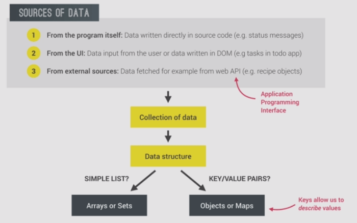
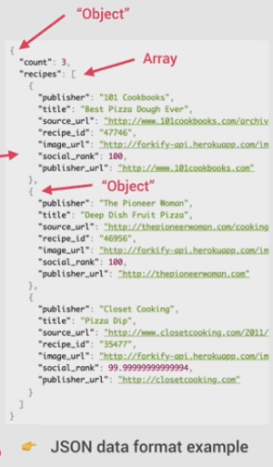
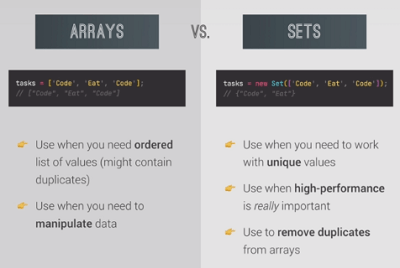
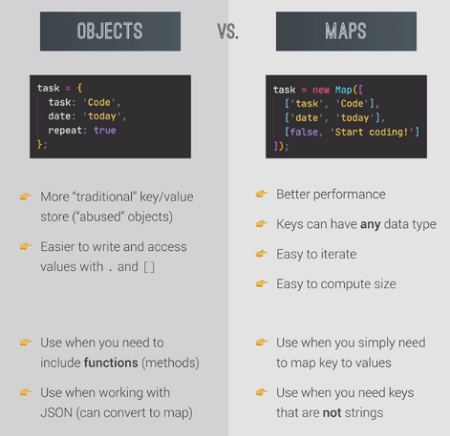

# ES6 DATA STRUCTURES

---

The brief description, practices and challenges using the ES6 data structures and methods such as
Sets, Maps, destructuring, Rest and Spread operators, for...of etc..\
All in the [script2.js](./script2.js),

## Which data structure to choose

---

* The Sources of Data

* There are also some other built in JS Data structures, like **WeakMap** and **WeakSet**, and several non-built in implemented data structures like, *Stacks*, *Queues*, *Linked lists*, *Trees*, *Hash tables* ..etc
* In modern JS, external data mainly comes from Web API's, which is in JSON format, which is essentially a JS object, maps and objects are the ways to store them.

  

Array Vs Sets and Objects Vs. Maps

---

* Array vs Sets

  

  * Operations like searching for an item and deleting an item is like 10 times faster in Sets than arrays.
  * Also sets can be used to remove duplicates from arrays.
  * It is built to compliment the arrays whenever dealing with unique values.

* Objects vs Maps

  

  * To store simple key value data, it is like abusing objects (it is the base of JS), so the maps really comes in handy. Maps offer better performance.
  * Maps are gaining strength and getting more abd more used now a days.
