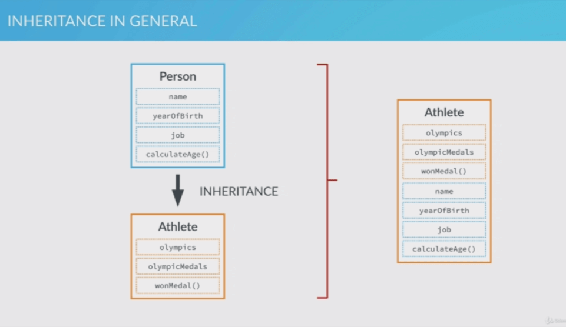

# ES6 JavaScript Changes

---

1. ## `var` replace with `const` and `let`.

   * `var` is function scoped but, `let` & `const` are block scoped, (block is a block of code wrapped between parenthesis, eg: if, for, while loops..)

   * ```javascript
     let i = 45;
     for (let i = 0; i < 5; i++) {
         console.log(i);
     }
     console.log(i);
     // output
     // 4
     // 45
     ```

2. ## Blocks and IIFEs

   * In ES6 the block scoped variables, give a new way of defining IIFEs.

      ```javascript
      {
          let a = 56;
          const b = 34;
          var c = 36;
      }
      console.log(a + b);  // Gives an error
      console.log(c);  // 3
      ```

3. ## Strings in ES6

    * Strings can be written in ES^ using the new "*template literals*",

      ```javascript
      let firstName = 'John';
      let lastName = 'Marques';
      const yearOfBirth = 1995;

      function calcAge(year) {
          return 2020 - yearOfBirth;
      }

      // ES5
      console.log('This is ' + firstName + ' ' + lastName + '. He was born in '
      + yearOfBirth + '. Today, he is ' + calcAge(yearOfBirth) + ' years old.')

      // ES6
      console.log(`This is ${firstName} ${lastName}. He was born in ${yearOfBirth}.
      Today, he is ${calcAge(yearOfBirth)} years old.`)
      ```

    * `startsWith` method,

        ```javascript
        const name = `${firstName} ${lastName}`;
        console.log(name.startsWith('J'));
        console.log(name.endsWith('n'));
        // Returns boolean, (case sensitive)
        // in between the string, There is `includes()`
        console.log(name.includes(' ')); // checks if there is any space
        ```

    * To repeat strings, `repeat`

        ```javascript
        console.log(`${firstName} `.repeat(3));

        // Gives 'John John John'
        ```

4. ### Arrow Functions

    * Using map function to calculate present age,

        ```javascript
        const years = [1990, 1965, 1982, 1937];

        // ES5
        var ages5 = years.map(function(el) {
            return 2020 - el;
        });
        console.log(ages5);

        // ES6 - uses less code & clean code
        let ages6 = years.map(el => 2020 - el);
        console.log(ages6);

        // With multiple arguments
        ages6 = years.map((el, index) => `Age element ${index + 1}: ${2020 - el}.`);

        // More actions
        ages6 = years.map((el, index) => {
            const now = new Date().getFullYear();
            const age = now - el;
            return `Age element ${index + 1}: ${age}.`
        });
        ```

    * Arrow Functions: Lexical 'this' keyword. Arrow functions share the surrounding `this` keyword [*"They use the `this` keyword of the function they are written in"*], to understand this in ES5,

        ```javascript
         var box5 = {
         color: 'green',
         position: 1,
         clickMe: function() {
             // button with class="green"
             document.querySelector('.green'). addEventListener('click',
             function() {
                 var str = 'This is the box number ' + this.position + ' and it is ' + this.color;
                 alert(str);
             });
           }
         }
         box5.clickMe(); // "This is the box number undefined and it is undefined"
        ```

    * The above result happens("values not read") because, `this` keyword actually points to the object only in a method call, in an inner function(or any other function) call, `this` points to global object (*"For a browser it is the window object"*).
    * A common practice to overcome this behavior is to assign the `this` keyword to a temporary variable in the method first then use the variable in the nested functions.
    * With ES6,

        ```javascript
        // ES6

        const box6 = {
            color: 'green',
            position: 1,
            clickMe: function () {
                // button with class="green"
                document.querySelector('.green').addEventListener('click',
                    () => {
                        const str = `This is the box number ${this.position} and ${''}it is ${this.color}`;
                        alert(str);
                    });
            }
        }
        box6.clickMe(); // "This is the box number 1 and it is green"

        // The ${''} is used as a hack to line brake, can use the "+" sign [`something` + `another`] also for the line brakes without extra spaces on large strings.
        ```

    * But if the method on its own is replaced with arrow functions,

        ```javascript
        clickMe: () => {
        // button with class="green"
        document.querySelector('.green').addEventListener('click',
            () => {
                const str = `This is the box number ${this.position} and ${''
                    }it is ${this.color}`;
                alert(str);
            });
        }
        ```

        It gives the same "undefined" error because, The `this` keyword passed to the arrow function at first is from the surrounding *global context*.
    * Function constructor with ES6, First trying the same with ES5,

        ```javascript
        function Person(name) {
            this.name = name;
        }

        // ES5
        Person.prototype.myFriends5 =
            function(friends) {
                var arr = friends.map(function(el) {
                    return this.name + ' is friends with ' + el;
                });
                console.log(arr);
            }

        var friends = ['Bob','Jhon', 'Marks', 'Sweet'];
        new Person('Jane').myFriends5(friends);
        ```

        Here also the name is not defined cz, of the same reason, the main prototype function have access to the 'this' keyword, but the function inside the map function doesn't, it gets the global `this`.
    * In ES5, there is also a common workaround (This issues are well known ones), ie, to use the `bind()` method to make a copy with the `this` variable set to `this` of the main `prototype`.

        ```javascript
        Person.prototype.myFriends5 =
        function (friends) {
            var arr = friends.map(function (el) {
                return this.name + ' is friends with ' + el;
            }.bind(this));
        }
        ```

    * In ES6, using arrow function, don't need this workaround,

        ```javascript
          Person.prototype.myFriends6 =
          function (friends) {
              var arr = friends.map(el => {
                  return `${this.name} is friends with ${el}`;
              });
          }
        ```

        Notice, here also, if the main function is assigned as arrow function, `this` will not works as normal `this`....

5. ## Destructuring

    * Convenient way to extract data from objects or an array, for ES5 it is like,

        ```javascript
        var john = ['John', 25, true];
        var name = john[0];
        var age = john[1];
        ```

    * ES6

        ```javascript
        const [name, year] = ['John', 25, true];
        console.log(name);  // John
        console.log(year);  // 25

        // , skips values
        const [name,, isMale] = ['John', 25, true];

        // swapping
        let a = 8, b = 6;
        [a, b] = [b, a];

        // Also with objects
        const obj = {
            firstName: 'John',
            lastName: 'Smith'
        };

        // Destructuring (variable names match the keys)
        const {firstName, lastName} = obj;
        console.log(firstName);  // John
        console.log(lastName);  // Smith

        // If need a separate variable name
        const { firstName: a, lastName: b } = obj;
        console.log(a);  // John
        console.log(b);  // Smith
        ```

        In nested objects too,

        ```javascript
        const LOCAL_FORECAST = {
          yesterday: { low: 61, high: 75 },
          today: { low: 64, high: 77 },
          tomorrow: { low: 68, high: 80 }
        };

        const { today: {low: lowToday, high: highToday}}  = LOCAL_FORECAST;
        // It creates two variables lowToday and highToday and grabs the data.
        console.log(lowToday, highToday);
        ```

        Practical application of destructuring, To return multiple values from a function

        ```javascript
        function calcAgeRetirement(year) {
            const age = new Date().getFullYear() - year;
            return [age, 65 - age];
        }

        const [age, retirement] = calcAgeRetirement(1994);
        console.log(age); // 26
        console.log(retirement); // 39
        ```

    * Destructuring can be done within the argument braces,

        ```javascript
        const profileUpdate = (profileData) => {
          const { name, age, nationality, location } = profileData;
          // do something with these variables
        }

        // Can be done like
        const profileUpdate = ({ name, age, nationality, location }) => {
          /* do something with these fields */
        }
        ```

6. ## Arrays in ES6

    * ES6 introduced new array methods for simplifying things like,

        ```javascript
        const boxes = document.querySelectorAll('.box');

        // To traverse through the nodelist returned in ES5
        var boxesArr5 = Array.prototype.slice.call(boxes);

        // To change all box colors to blue (ES5)
        boxesArr5.forEach(function(curr) {
        curr.style.backgroundColor = 'dodgerblue';
        });
        ```

    * In ES6, It can be done in a single line of code

        ```javascript
        Array.from(boxes).forEach(curr => curr.style.backgroundColor = 'dodgerblue');
        ```

7. ## Loops in ES6

    * When we need looping through an array, we use `forEach` or `map` method, But the problem with both of them is, we can't `break` from them or use the `continue` statement, for that we need to go back to conventional `for` loop, But for simple loops it is more code and variables, in the above code if need to change the text on the boxes that the color changed

        ```javascript
        for (var i = 0; i < boxesArr5.length; i++) {
          // check for the class with name "box blue"
          if (boxesArr5[i].className === 'box blue') {
              continue;
          }
          boxesArr5[i].textContent = 'I changed to Blue';
        }
        ```

    * Therefore in In ES6 to overcome this issue a new way of writing loops called `for of` loop, introduced,

        ```javascript
          const boxesArr6 = Array.from(boxes);

          for (const cur of boxesArr6) {
              if (cur.className.includes('blue')) {
                  continue;
              }
              cur.textContent = 'I changed to Blue';
          }
        ```

8. ## `find` and `findIndex` methods

    * ES6 introduces some more helping functions to the JS, to find the index or find the the odd one out.

        ```javascript
        // ES5

        var  ages = [12, 17, 16, 14, 19, 15, 11];

        // To determine the index of the ages which are greater than or equal to 18

        var full = ages.map(function(cur) {
            return cur >= 18
        })

        console.log(full);  // [false, false, false, false, true, false, false]

        // Which one is full age
        console.log(full.indexOf(true));

        // to find the exact year
        console.log(ages[full.indexOf(true)]);

        // In ES6, findIndex(), find() methods

        console.log(ages.findIndex(cur => cur >= 18));
        console.log(ages.find(cur => cur >= 18));
        ```

9. ## Spread Operator

    * A spread operator denoted by `...`(three dots), the operator just expands the array in to its components. For ES5, it need more efforts like,

        ```javascript
        function addFourAges (a, b, c, d) {
            return a + b + c + d;
        }

        // If the numbers are in an array,
        // ES5
        var ages = [18, 21, 34, 23];

        // the 'bind', 'call' and 'apply' methods needed 'this'(here don't any use-case so 'null')
        var sum2 = addFourAges.apply(null, ages);
        console.log(sum2);

        // In ES6, the `spread` operator simplifies it all,
        const sum3 = addFourAges(...ages);
        console.log(sum3);

        // Can use other functions easily, as Math.max requires
        // comma separated values than arrays.
        const MAX_AGE = Math.max(...arr); // returns 34
        ```

        It got more use cases, eg: for joining arrays.

        ```javascript
        const familySmith = ['John', 'Jane', 'Mark'];
        const familyMiller = ['Mary', 'Bob', 'Ann'];

        const bigFamily = [...familySmith, ...familyMiller, 'lilly'];
        ```

        The `spread` operator just expands the array and put there, so in above example it gives the output of two arrays combined.text-content
    * It can be applied not just on an array but also on nodelists(what the querySelectorAll returns.)

        ```javascript
        const h = document.querySelector('h1');
        const boxes = document.querySelectorAll('.box');

        const all = [h, ...boxes];

        Array.from(all).forEach(cur => cur.style.color = 'purple');
        ```

10. ## Function Parameters

    ### Rest Parameters

    * Allow us to pass an arbitrary number of arguments into a function,
    (like *args in python)
    * They uses the same `...`(three dots) representation, but the concept is exactly opposite, ie the spread operator takes an array and transforms into its values, while the rest parameter receives single values and converts it to an array.(when we call a function with multiple parameters)
    * For ES5,

    ```javascript
    function isFullage5() {
        console.log(arguments);
        var argsArray = Array.prototype.slice.call(arguments);

        argsArray.forEach(function(cur) {
            console.log((2020 - cur) >= 18);
        })
    }

    isFullage5(1990, 1995, 1996, 2013, 1997);
    ```

    in ES5, to receive an undefined number of arguments, don't define any parameters for a function, then just use the `arguments` variable(which is similar to `this` in which every execution context get access to.)

    It returns not exactly an array(does not got an Array - function constructor) but an object, For to loop through it, use the ES5 hack to convert it to an array.

    * In ES6, by making use of rest parameters

    ```javascript
    function isFullage6(...years) {
        years.forEach(cur => console.log((2020 - cur) >= 18));
    }

    isFullage6(1990, 1995, 1996, 2013, 1997);

    // Another example to find sum of all arguments
    const sum = (...args) => args.reduce((a, b) => a + b, 0);

    sum(1, 2, 3, 4);  // gives 10
    ```

    * collect the rest of the elements into a separate array. The result is similar to `Array.prototype.slice()`, as shown below:

      ```javascript
      const [a, b, ...arr] = [1, 2, 3, 4, 5, 7];
      console.log(a, b); // 1, 2
      console.log(arr); // [3, 4, 5, 7]
      ```

    The difference between the spread operator and the rest parameter is actually the place where we use it each, `spread` is used in a function call, and `rest` operator is in a function declaration to accept an arbitrary number of parameters.

    * To accept an extra parameter, if we need to modify the function also to accept a limit, in place of the hardcoded age.

    Again in ES5 the tricks needed

    ```javascript
    function isFullage5(limit) {
    var argsArray = Array.prototype.slice.call(arguments, 1);

    console.log(argsArray); // outs after kicking off the first number

    argsArray.forEach(function (cur) {
        console.log((2020 - cur) >= limit);
    })
    }

    isFullage5(21, 1990, 1995, 1996, 2013, 1997);
    ```

      In ES5, the problem is overcome using the same slice method, (they basically used to cut a piece of an array)

    * In ES6, there is not that much complication to add an extra argument,

      ```javascript
      function isFullage6(limit, ...years) {
          years.forEach(cur => console.log((2020 - cur) >= limit));
      }

      isFullage6(17, 1990, 1995, 1996, 2003, 1997);
      ```

    ### Default Parameter

    * To Preset one or more parameters of a function to default(if needed a default value)
    * The ES5 way of adding default parameter.
    * Here we only specify the first two arguments required, js assigned undefined to the other two values.
    * But if added a default for the last name and nationality, it can be solved, in ES5 it can be added
      using if-else statements or turnery operators,

      ```javascript
      function SmithPerson(firstName, yearOfBirth, lastName, nationality) {

          lastName === undefined ? lastName = 'Smith' : lastName = lastName;
          nationality = nationality === undefined ? 'Indian' : nationality;

          this.firstName = firstName;
          this.lastName = lastName;
          this.yearOfBirth = yearOfBirth;
          this.nationality = nationality;
      }

      var john = new SmithPerson('John', 1990);

      console.log(john);
      ```

    * In ES6,

      ```javascript
      function SmithPerson(firstName, yearOfBirth, lastName = 'Smith', nationality = 'American') {
          this.firstName = firstName;
          this.lastName = lastName;
          this.yearOfBirth = yearOfBirth;
          this.nationality = nationality;
      }
      ```

11. ## Maps in ES6

    Maps are new kind of data structures introduced in ES6. A map is a key: value data structure in
    (which is of course an object)
    * The difference is, one can use anything(numbers, strings, boolean or even functions and numbers)\
    in place of keys.(in objects, it is limited to strings).

    ```javascript
    // Creating a map:

      const question = new Map();

      // Setting up values
      // 0 position
      question.set('question', 'What is the official name of the latest major javascript version?');

      question.set(1, 'ES5');
      question.set(2, 'ES6');
      question.set(3, 'ES 2015');
      question.set(4, 'ES 2017');

      question.set('correct', 3);

      question.set(true, 'Correct answer:D');
      question.set(false, "Wrong, please try again!");

      console.log(question);

      // To get values from it.
      console.log(question.get('question'));

      // to get length of the map
      console.log(question.size);

      // Delete data from map
      question.delete(4);
      // here the element with key 4, (4 => 'ES 2017') gets deleted.
      // if deletion done on a non-existent element, nothing happens
      question.delete(4);

      // Check if data is there with "has".
      if (question.has(4)) {
          // question.delete(4);
          console.log("has worked");
      }

      // To clear
      question.clear();
      ```

    * Maps are iterable, one can iterate through the maps and change its values.\
    forEach works similar to other iterables, ie has access to current element, key and the entire map.

    ```javascript
    question.forEach((value, key) => console.log(`${key} and ${value}`));
    ```

    * Using the new `for of` method,

    ```javascript
    // Using destructuring and with the help of .entries()
    for (let [key,value] of question.entries()) {
        console.log(`${key} and ${value}`);
    }
    ```

    * Instead of printing all elements from the map, lets try to print all 4 answers

    ```javascript
    // Using destructuring and with the help of .entries()
    for (let [key, value] of question.entries()) {
        if (typeof(key) === 'number') {
            console.log(`Answer ${key}: ${value}`);
        }
    }

    // Prompt the user to write the correct answer
    const ans = parseInt(prompt('Write the correct answer'));

    // Check for the correct answer, if the expression is correct it will extract the 'true' key value
    question.get(ans === question.get('correct'));
    ```

    * maps are now better than object to create hash maps, use any data type as keys, maps are iterable\
    easily loop through them and to manipulate data with them, get the size of a map using the `size` property.

    ```javascript
    console.log(question.size)
    ```

12. ## CLASSES IN ES6

    ---

    * classes just not adds any more functionality in javascript, they are syntactic sugars, which
    helps to write more easy and understandable code. It just makes easier to implement inheritance,
    and to create objects based on blue prints,

    * In ES5, these blueprints are simply the function constructors, ie, creating the same person function
    constructor,

    ```javascript
    var Person5 = function(name, yearOfBirth, job) {
        this.name = name;
        this.yearOfBirth = yearOfBirth;
        this.job = job;
    }

    Person5.prototype.calculateAge = function() {
        var age = new Date().getFullYear() - this.yearOfBirth;
        console.log(age);
    }

    var john5 = new Person5('John', 1995, 'teacher');
    john5.calculateAge();   // Gives 25
    ```

    * Using ES6 classes, nicely structured, Easier to write (syntactic sugar)

    ```javascript
    class Person6 {
        // All classes need a constructor method
        constructor (name, yearOfBirth, job) {
            this.name = name;
            this.yearOfBirth = yearOfBirth;
            this.job = job;
        }

        // prototype just added inside the class
        calculateAge() {
            let age = new Date().getFullYear() - this.yearOfBirth;
            console.log(age);
        }
    }

    const john6 = new Person6('John', 1995, 'teacher');
    john6.calculateAge();
    ```

    * This all just looks like javascript is mimicking python, So many programmers criticizing `classes`,
    because they hides the object oriented nature of inheritance in javascript.
    * Another important thing to add with the classes are static methods, ie methods that are attached to the
    classes, but not inherited by the class instances(objects that are created through the class.)

    ```javascript
    // Add this to the classes
    class Person6 {
        // All classes need a constructor method
        constructor (name, yearOfBirth, job) {
            this.name = name;
            this.yearOfBirth = yearOfBirth;
            this.job = job;
        }

        // prototype just added inside the class
        calculateAge() {
            let age = new Date().getFullYear() - this.yearOfBirth;
            console.log(age);
        }

        static greeting() {
            console.log('Hey there!');
        }
    }

    const john6 = new Person6('John', 1995, 'teacher');
    john6.calculateAge();

    // only way to call the static function.
    Person6.greeting();

    ```

     * It can only be used as helper functions, it is basically a method attached to the class definitions,\
     which is basically a function, that is under the hood an object, so a static methods are just methods in an
     object wrapped in some syntactic sugar. Not really a useful one.
     * The class definitions are not hoisted, so it need to implement a class and only latter in the code, can start using it.
     * Its only add methods to classes directly not properties, (inheriting properties through object instances is not a best practice.)
     * A basic implementation of ES6 classes with `setter` and `getter` functions,\
       Getter functions are meant to simply return (get) the value of an object's private variable to the user without the user directly accessing the private variable. Setter functions are meant to modify (set) the value of an object's private variable based on the value passed into the setter function.

       ```javascript
       class Book {
         constructor(author) {
           this._author = author;
         }
         // getter
         get writer() {
           return this._author;
         }
         // setter
         set writer(updatedAuthor) {
           this._author = updatedAuthor;
         }
       }
       const novel = new Book('anonymous');
       console.log(novel.writer);  // anonymous
       novel.writer = 'newAuthor';
       console.log(novel.writer);  // newAuthor
       ```

     * Notice the syntax used to invoke the getter and setter. They do not even look like functions. Getters and setters are important because they hide internal implementation details.
     * Note: It is convention to precede the name of a private variable with an underscore (_). However, the practice itself does not make a variable private.

13. ### Implementing Inheritance from one class to another.

    

    * Generic class person for all persons,
    * Specific sub class for an athlete, an athlete is also a person but contains some more specific attributes and methods
    * Athlete class now inherit from person.
    * In ES5, without the syntactic sugars,

    ```javascript
    var Person5 = function(name, yearOfBirth, gender) {
        // Just a default value
        this.isHuman = true;
        this.name = name;
        this.yearOfBirth = yearOfBirth;
        this.gender = gender;
    }

    Person5.prototype.calculateAge = function() {
        var age = new Date().getFullYear() - this.yearOfBirth;
        console.log(age);
    }

    // The person5  function constructor, will be the superclass here
    // The subclass will be the athlete class

    var Athlete5 = function (name, yearOfBirth, gender, olympicGames, medals) {
        // Just calls the parentclass or superclasss
        Person5.call(this);
        this.olympicGames = olympicGames;
        this.medals = medals;
    }
    ```

    * There need to call the superclass fun. constructor with the `this` keyword,
    * cz (remember with the `new` operator, it creates a new instance of the class and assign the `this` keyword to it, thereby inheriting all the parent properties to the instance created, also prototype methods)
    * To inherit all the properties of superclass(Person5) to the Athlete5 class, use the call method to call the superclass, the `this` sets the current class as a child.
    * To check this

    ```javascript
    // Creating an instance
    var usain = new Athlete5();
    console.log(usain.isHuman); // Gives true
    ```

### Throwback to the call, apply, bind trios

  ```javascript
  var sampleObj = {num:2};

  var justAdd = function(a, b) {

      return this.num + a + b;
  };
  ```

* But the there is no "num" assigned to `this` function, To assign, use the `call` method

  ```javascript
  var answer;
  answer = justAdd.call(sampleObj, 3, 5);
  console.log(answer);  // Gives 10
  ```

* Here, the `justAdd` is called with the sample object (set to `this`), so `this.num = 3`\
  To use the apply method,

  ```javascript
  var argArr = [3, 5];
  answer = justAdd.apply(sampleObj, argArr);

  console.log(answer);  // gives same answer 10
  // apply just uses an array of arguments.

  // To use the bind method
  answer = justAdd.bind(sampleObj, 3, 5);

  console.log(answer); // The answer now doesn't returns a value, but a function

  // To examine it
  console.dir(answer);
  // It is now a function with name `bound justAdd` and has "[[BoundThis]]: Object - num:2 ,[[BoundArgs]]: Array(1), 0: [3,5]"

  // It needed to pass arguments as single (not as an array)
  console.log(answer()); // Gives 10

  // But the answer now is a function, one can pass the arguments directly
  answer = justAdd.bind(sampleObj);
  console.log(answer(3, 5));
  ```

* Now back to inheritance -- Above, done the opposite thing with `call` method,ie called the Person5 fun. constructor with current one(ie the `this`), and used no arguments.
* But with arguments as normal,

  ```javascript
  var Athlete5 = function (name, yearOfBirth, gender, olympicGames, medals) {
      // Just calls the parentclass or superclasss
      Person5.call(this, name, yearOfBirth, gender);
      this.olympicGames = olympicGames;
      this.medals = medals;
  }
  ```

* Checking

  ```javascript
  var usain = new Athlete5("Usain Bolt", 1982, "Male", 4, 18);

  console.log(usain.isHuman);  //true
  console.log(usain.yearOfBirth); //1982
  console.log(usain.name); // Usain Bolt
  console.log(usain.olympicGames); // 4
  console.log(usain.medals); // 18
  ```

* To create the correct prototype chain(manually setting), in other words to inherit prototype from the parent use `Object.create`

  ```javascript
  Athlete5.prototype = Object.create(Person5.prototype);
  // Now the prototype chains are connected,

  var usain = new Athlete5("Usain Bolt", 1982, "Male", 4, 18);

  // Testing
  usain.calculateAge(); // Returns 19
  ```

* With ES6, which introduces the so called classes, the whole thing is wrapped up in syntactic sugar,

  ```javascript
  class Person6 {
      // All classes need a constructor method
      constructor (name, yearOfBirth, job) {
          this.name = name;
          this.yearOfBirth = yearOfBirth;
          this.job = job;
      }

      // prototype just added inside the class
      calculateAge() {
          let age = new Date().getFullYear() - this.yearOfBirth;
          console.log(age);
      }
  }

  // ES6 got classes (not in the same meaning as classes in other languages), with `extends` keyword,
  // the subclass "extends" from the super class.

  class Athlete6 extends Person6 {
      constructor(name, yearOfBirth, job, olympicGames, medals) {
          // No need to manually call the super class, everything happens behind the scenes
          super(name, yearOfBirth, job);
          this.olympicGames = olympicGames;
          this.medals = medals;
      }

      wonMedal() {
          this.medals++;
          console.log(this.medals);
      }
  }

  const johnAthlete6 = new Athlete6('John', 1985, 'swimmer', 3, 10);

  johnAthlete6.wonMedal(); // 11
  johnAthlete6.calculateAge(); // 35
  ```

  * The ES6 way is more easier to read, the optimum thing to do is understand all these with ES5,
  Do it in the way of ES6.
  * conclusion: the inheritance actually is prototype inheritance in classes.

### When you should not use Arrow Functions

---

1. In Object Methods.

   ```javascript
   var cat = {
      lives: 9,
      jumps: () => {
       this.lives--;
      }
   }
   ```

   When you call cat.jumps, the number of lives does not decrease. It is because this is not bound to anything, and will inherit the value of this from its parent scope.

2. Callback functions with dynamic context
   If you need your context to be dynamic, arrow functions are not the right choice. Take a look at this event handler below:

   ```javascript
   var button = document.getElementById('press');
   button.addEventListener('click', () => {
     this.classList.toggle('on');
   });
   ```

   If we click the button, we would get a TypeError. It is because this is not bound to the button, but instead bound to its parent scope.

3. When it makes your code less readable
   It is worth taking into consideration the variety of syntax we covered earlier. With regular functions, people know what to expect. With arrow functions, it may be hard to decipher what you are looking at straightaway.

### When you should use them

   Arrow functions shine best with anything that requires this to be bound to the context, and not the function itself.

   Despite the fact that they are anonymous, I also like using them with methods such as map and reduce, because I think it makes my code more readable. To me, the pros outweigh the cons.
