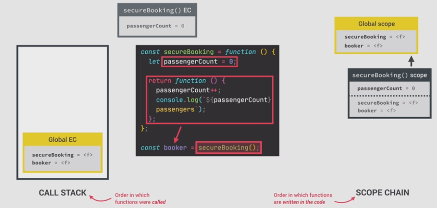

# Closure in JS

---

## Working of a normal function

* Let a normal function called secureBooking executes as shown below,

```javascript
const secureBooking = function () {
  let passengerCount = 0;

  // The return function
  return function () {
    passengerCount += 1;
    console.log(`${passengerCount} passengers`);
  };
};

const booker = secureBooking();
```

* At the start of running this code there is secureBooking function in the global execution context, its scope(global scope) contains that function address only.
* Then the secureBooking is executed, new exe. cnxt and scopes created, the new scope only contains the passengerCount variable,(but the global scope is always accessible),
* In the next line a new function is returned and it is stored in the booker variable,(address)
* Now the secureBooking function is finished and its exe. context returns.
  

* Now call the booker function, lets call it three times
* Each time the function executes it updates the passesngerCount and prints to the console,

```javascript
`1 passengers``2 passengers``3 passengers`;
```

* But isn't the function that contains the VE of passengerCount closed already ie its execution context is left the stack already, now where the value is taken.???? how comes the return function access the value of passengerCount???? There comes the closure

* The environment that creates the return function is already gone, but the function(now stored in booker, so booker()) got access to the variable inside it. That's what the closure does, It remembers all the variables for the functions that is **bound by closure**.
* So to explain this one need to add the idea of closure with the scope chain. lets go through stepwise what's happening

### ---

* When the `booker()` function is called, new exe. cntxt is created in the call stack, it VE contains no elements as no one present in the function
* The fun. is a child function of the global context, so is a child scope of global scope as shown.
* So how does the function access the passengerCount variable.

> **Any function always have access to the variable environment of the execution context in which the function was created**

* Here the booker() fn. was born in the execution context of the secureBooking function, which is closed already but it's got the access to the VE of that function that contains the passengerCount variable..\
  That connection is closure.


So in simple terms closure is how the Variable Environment is attached to a function, it helps preserving the scope chain.

Even though the execution context is destroyed, the VE keeps living in the engine and closure aids it(or simply it is called closure)

Why it is called closure cz the, because it can say here, the booker function is closed over(_not fully closed_) to its parent scope/VE, the closed over VE stays with the function for ever and can able to use it for ever.

More intuitively, thanks to closure so that a function didn't looses its connections to variables that existed in its birthplace(memories never dies..)

* When execution happens, the function attempts to increase the passengerCount variable, it looks in the current scope, not found so next it looks in the closure, so yes even before looking in the scope chain, so the closure got priority over the scope chain.

* so the passenger count becomes one and the exe. contxt pops out of the stack, then this happens again till the passengerCount gets 3.

### Analogies that helps to understand closure

> Closure is the closed-over variable environment of the execution context in which a function was created, even after that execution context is gone.


### functions with closure

* To see the closure bound variables in console, as per the example here do a `console.dir(booker)`.
* It outs a function with


* Look at the closure coming from secureBooking. The double square brackets indicate that it can't be accessed from the code and it is an internal property.