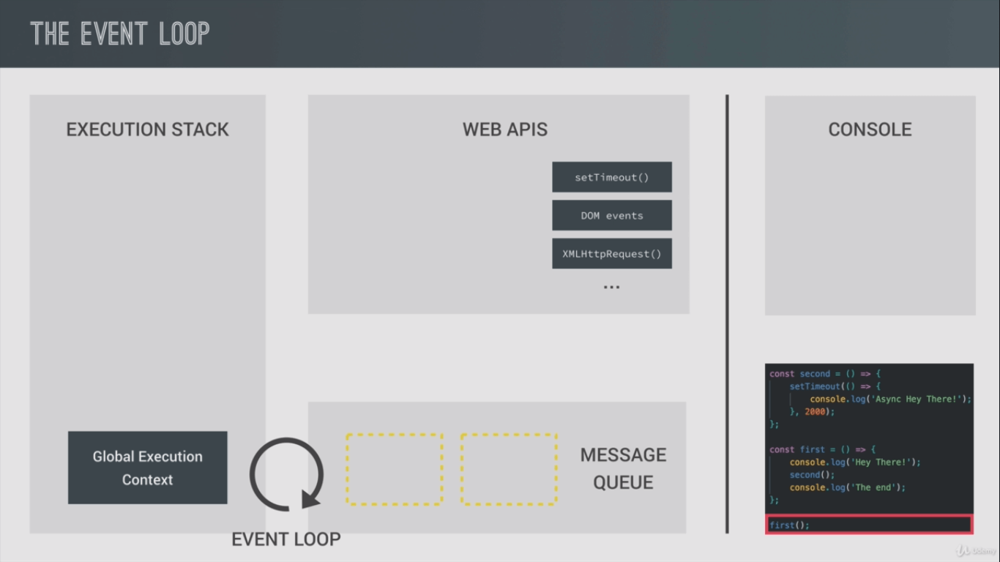
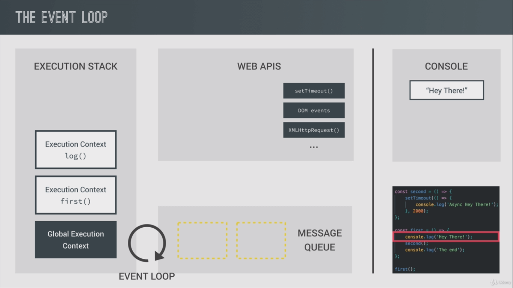
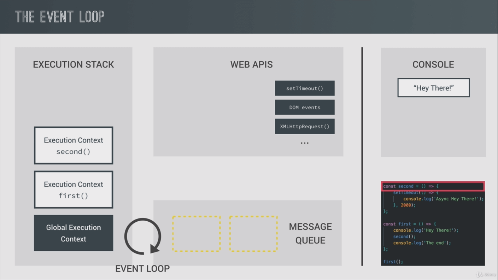
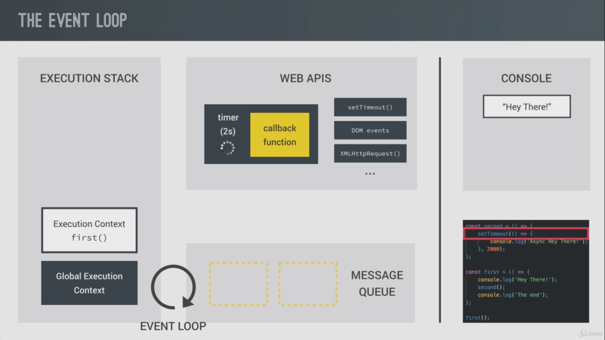
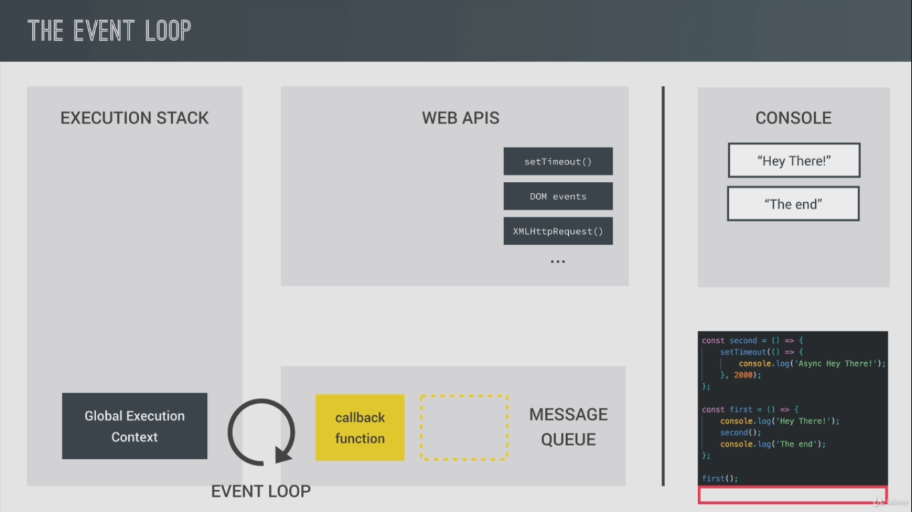
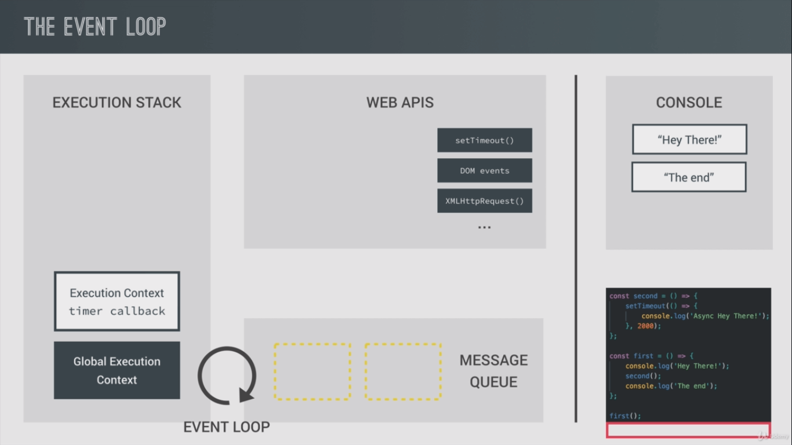

# Asynchronous Javascript
---

### Writing a sample fu. in present syn. style javascript
```javascript
const first = () => {
    console.log('Hey There');
}

first();  // Hey There
```

Adding a `second()` function on top,

```javascript
const second = () => {
    console.log('I\'m Second');
}

const first = () => {
    console.log('Hey There');
    second();
    console.log('The End');
}

first();

/* Now console,
Hey There
I'm Second
The End
*/
```
This all following the synchronous pattern, that the instructions are executing one after another,
in a synchronous manner.

Adding Asynchronous code using `setTimeout` function, in the second function. In the `setTimeout`\
function there needed a callback function and a time (in milliseconds),

```javascript
const second = () => {
    setTimeout(() => {
        console.log('Async, Hey there!');
    }, 2000)
}
```
Now the first function run, by the time second one is called, but its not executing immediately, because of the\
timeout set it waits 2 seconds and then executes,
```javascript
Hey There
The End
// After 2 seconds
Async, Hey there!
```
Notice that the `The End` which is logged after the second fun. call, executes immediately. The execution,
doesn't wait for the other one to complete its turn, that's how JS works..

Codes not run in step by step, but there is parallel tasks executing,

Lets dive deep into it,

## Synchronous VS Asynchronous
---

Javascript is single threaded, means, two statement in javascript can not be executed in parallel. Execution happens line by line, which means each javascript statements are synchronous and blocking. But there is a way to run your code asynchronously, if you use `setTimeout()` function, a Web API given by browser, which makes sure that your code executes after specified time (in millisecond).

Till now in the practice, always being synchronous code, that is one statement is processed after other, line by line, single thread execution.\
The examples of syn. and asyn. functions are depicted above.

There in the second one, it contains some asynchronous javascript, like the `first` function calls the `second` function, which calls the `setTimeout` function, i.e. a timer starts with 2 seconds background.\
However it will not make the code stop for 2s, the fn. returns to `first` logs the next content, \
Then after 2 seconds, the second function logs its content.

* Another Example
```javascript
const image = document.getElementById('img').src;

processLargeImage(image, () => {
    console.log("image Processed!");
})
```
This is a sample of a large image processing function, which takes some tome to complete, one cannot wait in a html page for this process completion to load up next contents,\
What we can do to continue the flow of processes is to pass a callback function, which is called at the time the image starts processing, \
Just like that we created ***Asynchronous code***, it is the basic principle behind the asyn. code, *we don't wait till one thing to complete, do start the other tasks immediately*..
  * By allowing asynchronous functions to run in the "Background",
  * We pass in callbacks that run once the function has finished its work.
  * Move on immediately, so that the code is never blocked..

### Behind the scenes...


#### **The Event Loop**

* The execution stack is learnt already, which is there
* The new members are the message queue, Event loop and Web APIs, lets look through it.
* Message Que(or callback que):- This is where your asynchronous code gets pushed to, and waits for the execution. For example, the event listeners if get activated waits here for the execution as soon as the main stack is cleared.
* Web APIs: - This are things outside the javascript engine for eg, this `setTimeout` function, event listeners etc, all the asynchronous things runs here(such as the timer, or the event listener looking for events) while the code execution not gets affected, as soon as there criteria met, they gets passed to message que to enter the execution stack.
* Event loop: - Which monitors and pushes the waiting events to the stack..

<div style="display: flex; justify-content: flex-start; flex-wrap: wrap; width: 100%;">
  
  
  
  
</div>

With using the previous example, lets try to understand the javascript runtime,
- When the first function gets called, an execution context for that fn. put on the execution stack
on top of the global execution stack.(or the call stack)
- Then the `console.log` is called new execution context created, text is logged to console, then it pops off from the stack,
- Moving to the `second` function, new execution context is created and, very next the setTimeout gets called its own context gets created on top.
- From where the setTimeout function comes from, it is from the WEB APIS, which is outside of the javascript engine itself. also the DOM manipulation functions, http request fpr AJAX, geo-location, localStorage they all come from outside of the javascript engine.
- But we can access them all because they are also a part of the *javascript runtime*.
- Now the timer running (asynchronously), our fn keeps going. The timer is created together with the callback function,\
inside the web APIs environment, there it keeps running till the set time.


- Since the timer keeps working background, we don't need to wait, it returns the "started successfully" things back,
- Receiving the return, setTimeout completes and popped off from the stack, so as the execution context of the `second`
function (as a `return` received.).


- Now the pointer is back to the `first` function, the `The End` is printed, log context created and all gets cleared after, so back to the initial state.
- Now the usual synchronous execution of things completed, but the timer is still running background, ...it runs...runs..oh, now the 2 seconds are passed, it disappears.
- Now the call-back function simply moves to the message que where it waits to be executed as soon as the execution stack gets empty.\
(similar to what happens to the DOM events. there the event listeners sit in the web-APIs while the code is executing, waiting for a certain event to happen as soon as it occurs, when it happens it gets placed in the message que..then it is showtime..)
[Doctor(javascript-engine)-Hospital-Token-Waiting-Attender(event-loop)-Analogy]


- So, finally how the callback function waiting in the message que executed, thats where the ***Event Loops*** comes into play,

> The Job of the Event loop is to constantly monitor the message queue and the execution stack, and to push the first callback function inline to the execution stack ass soon as the stack is empty.

As per our example following right now our stack is empty, and got one callback(after the timer) is waiting to be get executed,
the event loop takes that one and pushes it to the stack, where the new execution context is created for the function.


Thats it...it is what the event loop does, then the log function runs, then all pops of the stack and all the execution completed.
If there is some more requests waiting, such as AJAX requests or requests from the DOM events, now the execution context is free and it is there time.. the event loops
This example is a simulation of the real world cases happening such as an AJAX request to external API, etc..
