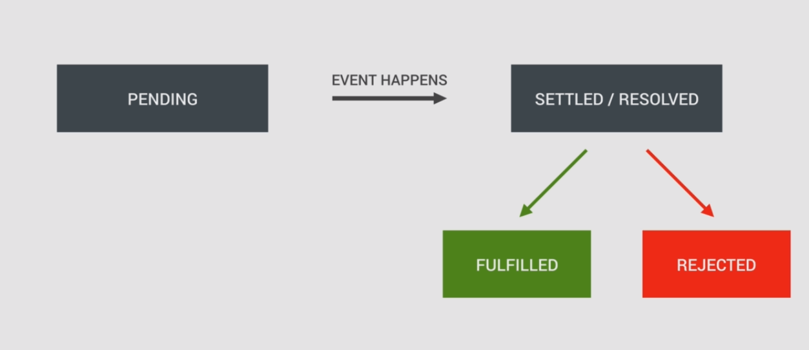

# Asynchronous Javascript
---

### Writing a sample function in present synchronous style javascript
```javascript
const first = () => {
    console.log('Hey There');
}

first();  // Hey There
```

Adding a `second()` function on top,

```javascript
const second = () => {
    console.log('I\'m Second');
}

const first = () => {
    console.log('Hey There');
    second();
    console.log('The End');
}

first();

/* Now console,
Hey There
I'm Second
The End
*/
```
This all following the synchronous pattern, that the instructions are executing one after another,
in a synchronous manner.

Adding Asynchronous code using `setTimeout` function, in the second function. In the `setTimeout`\
function there needed a callback function and a time (in milliseconds),

```javascript
const second = () => {
    setTimeout(() => {
        console.log('Async, Hey there!');
    }, 2000)
}
```
Now the first function run, by the time second one is called, but its not executing immediately, because of the\
timeout set it waits 2 seconds and then executes,
```javascript
Hey There
The End
// After 2 seconds
Async, Hey there!
```
Notice that the `The End` which is logged after the second fun. call, executes immediately. The execution,
doesn't wait for the other one to complete its turn, that's how JS works..

Codes not run in step by step, but there is parallel tasks executing,

Lets dive deep into it,

## Synchronous VS Asynchronous
---

Javascript is single threaded, means, two statement in javascript can not be executed in parallel. Execution happens line by line, which means each javascript statements are synchronous and blocking. But there is a way to run your code asynchronously, if you use `setTimeout()` function, a Web API given by browser, which makes sure that your code executes after specified time (in millisecond).

Till now in the practice, always being synchronous code, that is one statement is processed after other, line by line, single thread execution.\
The examples of syn. and asyn. functions are depicted above.

There in the second one, it contains some asynchronous javascript, like the `first` function calls the `second` function, which calls the `setTimeout` function, i.e. a timer starts with 2 seconds background.\
However it will not make the code stop for 2s, the fn. returns to `first` logs the next content, \
Then after 2 seconds, the second function logs its content.

* Another Example
```javascript
const image = document.getElementById('img').src;

processLargeImage(image, () => {
    console.log("image Processed!");
})
```
This is a sample of a large image processing function, which takes some tome to complete, one cannot wait in a html page for this process completion to load up next contents,\
What we can do to continue the flow of processes is to pass a callback function, which is called at the time the image starts processing, \
Just like that we created ***Asynchronous code***, it is the basic principle behind the asyn. code, *we don't wait till one thing to complete, do start the other tasks immediately*..
  * By allowing asynchronous functions to run in the "Background",
  * We pass in callbacks that run once the function has finished its work.
  * Move on immediately, so that the code is never blocked..

### Behind the scenes...


#### **The Event Loop**

* The execution stack is learnt already, which is there
* The new members are the message queue, Event loop and Web APIs, lets look through it.
* Message Que(or callback que):- This is where your asynchronous code gets pushed to, and waits for the execution. For example, the event listeners if get activated waits here for the execution as soon as the main stack is cleared.
* Web APIs: - This are things outside the javascript engine for eg, this `setTimeout` function, event listeners etc, all the asynchronous things runs here(such as the timer, or the event listener looking for events) while the code execution not gets affected, as soon as there criteria met, they gets passed to message que to enter the execution stack.
* Event loop: - Which monitors and pushes the waiting events to the stack..

<div style="display: flex; justify-content: flex-start; flex-wrap: wrap; width: 100%;">
  
  
  
  
</div>

With using the previous example, lets try to understand the javascript runtime,
- When the first function gets called, an execution context for that fn. put on the execution stack
on top of the global execution stack.(or the call stack)
- Then the `console.log` is called new execution context created, text is logged to console, then it pops off from the stack,
- Moving to the `second` function, new execution context is created and, very next the setTimeout gets called its own context gets created on top.
- From where the setTimeout function comes from, it is from the WEB APIS, which is outside of the javascript engine itself. also the DOM manipulation functions, http request fpr AJAX, geo-location, localStorage they all come from outside of the javascript engine.
- But we can access them all because they are also a part of the *javascript runtime*.
- Now the timer running (asynchronously), our fn keeps going. The timer is created together with the callback function,\
inside the web APIs environment, there it keeps running till the set time.


- Since the timer keeps working background, we don't need to wait, it returns the "started successfully" things back,
- Receiving the return, setTimeout completes and popped off from the stack, so as the execution context of the `second`
function (as a `return` received.).


- Now the pointer is back to the `first` function, the `The End` is printed, log context created and all gets cleared after, so back to the initial state.
- Now the usual synchronous execution of things completed, but the timer is still running background, ...it runs...runs..oh, now the 2 seconds are passed, it disappears.
- Now the call-back function simply moves to the message que where it waits to be executed as soon as the execution stack gets empty.\
(similar to what happens to the DOM events. there the event listeners sit in the web-APIs while the code is executing, waiting for a certain event to happen as soon as it occurs, when it happens it gets placed in the message que..then it is showtime..)
[Doctor(javascript-engine)-Hospital-Token-Waiting-Attender(event-loop)-Analogy]


- So, finally how the callback function waiting in the message que executed, thats where the ***Event Loops*** comes into play,

> The Job of the Event loop is to constantly monitor the message queue and the execution stack, and to push the first callback function inline to the execution stack ass soon as the stack is empty.

As per our example following right now our stack is empty, and got one callback(after the timer) is waiting to be get executed,
the event loop takes that one and pushes it to the stack, where the new execution context is created for the function.


Thats it...it is what the event loop does, then the log function runs, then all pops of the stack and all the execution completed.
If there is some more requests waiting, such as AJAX requests or requests from the DOM events, now the execution context is free and it is there time.. the event loops
This example is a simulation of the real world cases happening such as an AJAX request to external API, etc..


## Asynchronous Javascript - Traditional Way (Old Way)
---
Creating a fake recipe reader, gonna fake some AJAX calls, as it is loading data from an external web server,\
using setTimeouts,\
First it gets some id's, then the recipes..

```javascript
function getRecipe() {
    // 1. To simulate the AJAX calls
    setTimeout(() => {
        // the fetched recipe id's
        const recipeID = [523, 883, 432, 974];
        console.log(recipeID);

        // 2. new-timer to fetch data from a single id
        setTimeout(id => {
            // For simulating a remote server
            const recipe = {
                title: 'Chicken Curry',
                publisher: 'Akshay'
            };
            console.log(`${id}: ${recipe.title}`);

            // 3. Adding a third level of timeout
            setTimeout(publisher => {
                // block scoped
                const recipe = {
                    title: 'Italian Pizza',
                    publisher: publisher
                };
                console.log(recipe);
            }, 1500, recipe.publisher)

        }, 2000, recipeID[2])

    }, 1500)
}

getRecipe();
```

- The data(in the recipeID) appears after 1.5 seconds, like coming from a server.\
then it needs to fetch one of the id detailed data..
- The value needed to be passed to the callback function as third argument, here the id(432) get\
passed to `setTimeout()` function.
- Now after 2s logged data(id and title) appears on the screen...with 1.5s delay/
```javascript
// delat: 1.5s
(4) [523, 883, 432, 974]
// after 2s
432: Chicken Curry
```
- To get things more complex lets add a third level, such as one need to get another recipe from the same publisher
so, we pass the publisher as the `argument` to the callback function.
- it gets displayed after 1.5 seconds. now the first recipe and the related recipe gets displayed
```javascript
// delat: 1.5s
(4) [523, 883, 432, 974]
// after 2s
432: Chicken Curry
// after 1.5s
{title: "Italian Pizza", publisher: "Akshay"}
```

This now is like some chained AJAX calls getting some data from a server, if  there is more and more chaining like\
10 levels inside one another, then all the callbacks appears one another creating a so called, **Callback Hell**..

The left triangle we see on the code (i.e. looping after looping)..It gets a lot messy and unmanageable.

Therefore in ES6, something called **Promise**s introduced..\
with promises, the callback hell can be avoided, and have a nicer and cleaner syntax with all functionality,\
Lets have a look into that..

## **Promises** in ES6 JavaScript.
---

- ### What is a promise in JS ?
- *Simply it can say a promise is an Object(like all other things in js), that keeps track about whether a
certain event has happened already or not.*
- If the event did happened, then the promise determines what happens after that (events are asyn. events\
like data from an AJAX call, timer finishing)
- Promise-- implements the <u>concept of a future value that we're expecting,</u> its like we are saying get that data from the background for me, then the promise promises that and we can go back and handle that in the future.

When dealing with time sensitive code now, a promise can have different states\
* Before the event has happened, the promise is *pending*, after it has happened, the promise is now *settled or resolved*..


* If the promise was successful, i.e. the result is available, then the promise gets *fulfilled*, but if it is an error, then the promise is *rejected*, these two situations happens and need to be handled in the code.


In other terms(practical terms), one can produce and consume promises,
* When producing: - we create a new promise and sent a result using that promise.
* When consuming: - we can use callback functions for fulfillment and rejections of promises.

Now we can create some promises by recreating the example in previous section,
```javascript
const getIDs = new Promise((resolve, reject) => {
    setTimeout(() => {
        //1. After 1.5 promise successful, result passed
        resolve([523, 883, 432, 974]);
    }, 1500)
});
```

Use the new keyword as usual to create a new promise,
- Executer(The arrow fn. inside) is a function which is immediately called once the promise is created..
- Assign the promise to a variable, so as to recreate the prv. example. This first promise is responsible for getting the ID's as like in the first timer,
- The Executer fn. takes in two arguments,which are the callback functions- `resolve` and `reject`, as the executer function
is used to inform the promise the event handling successful or not, if successful --> **resolve**, else if there is no
results --> **reject** gets called.
- (Again, faking the AJAX call with setTimeout functions.), the timer is set to 1.5s after the callback function gets called.
- Similarly return some fake data with the id as before, for that now call the resolve function, remember resolve is
called when the event gets successful, so adding a `resolve` for the event as it successful.
- `resolve` takes an argument, which is for the result of the promise and this is how to return the result from a promise
if it was successful(here we need the array of ids)

The timer is impossible to fail(it always finishes), but in real world all requests don't come back with results,
as in case it don't need to implement the reject case. so as it always marks as fulfilled and the result get resolved.\
Now the simple promise is produced and stored in the `getIDs` variable.

As a next step, we can look at how to consume this promise.

- To do that one can use these two methods on all promises, which are the `then` and `catch` methods.(all of the promise
objects inherit these methods)

The `then` method allows one to add an event-handler for the case fulfilled condition, i.e. it determines what to do
with the result.
- The argument passed to the callback function(the arrow function), will be the result of the successful promise,(here
in our case, the ids array.)
```javascript
getIDs.then(IDs => {
    // logging the result array to console
    console.log(IDs);
});
```
```javascript
// Now with delay of 1.5s, array gets logged in as same
(4) [523, 883, 432, 974]
```

On the counter side the `catch` method allows one to add handler, when the promise gets rejected, error happens,\
Can chain this together
```javascript
getIDs
.then(IDs => {
    // logging the result array to console
    console.log(IDs);
})
.catch(error => {
    // the reject error handling
    console.log(error);
})
```
- but to visualize it, use a `reject` call with the array, or an "ERROR" message, if there is a reject call and no `catch`
methods implemented, then it gets an error,
```javascript
Uncaught (in promise) ERROR
```
* Adding another two promises, to make it similar to the first example,
```javascript
// 2. Function to receive an id and returns a promise
const getRecipe = recID => {
    return new Promise((resolve, reject) => {
        setTimeout( id => {
            const recipe = {
                title: 'Chicken Curry',
                publisher: 'Akshay'
            };
            resolve(`${id}: ${recipe.title}`);
        }, 1500, recID);
    });
};
```
* To consume this promise
```javascript
getIDs
.then(IDs => {
    // logging the result array to console
    console.log(IDs);
    // consuming the 2nd promise, by calling the function
    getRecipe(IDs[2]).then()
})
```
* But it wouldn't solve the problem of **Callback Hell**.
* So in promise there is a beautiful process called ***chaining***. one can return a promise from\
then method, and then simply add the next them method after it, the final result now,

```javascript
const getIDs = new Promise((resolve, reject) => {
    setTimeout(() => {
        //1. After 1.5 promise successful, result passed
        resolve([523, 883, 432, 974]);
    }, 1500)
});

// 2. Function to receive an id and returns a promise
const getRecipe = recID => {
    return new Promise((resolve, reject) => {
        setTimeout( id => {
            const recipe = {
                title: 'Chicken Curry',
                publisher: 'Akshay'
            };
            resolve(`${id}: ${recipe.title}`);
        }, 1500, recID);
    });
};

getIDs
.then(IDs => {
    // logging the result array to console
    console.log(IDs);
    // get the promise and return it,
    return getRecipe(IDs[2]);
})
// this chained then handles the result of the returned promise
.then(recipe => {
    console.log(recipe);
})
.catch(error => {
    // the reject error handling
    console.log(error);
})
```
* Result
```javascript
// With 1.5s delay
[523, 883, 432, 974]
// After another 1.5s delay
2: Chicken Curry
```
* Now the code is nice and separated into different functions,
* Lets add the final function, to fetch a recipe related to the author of the
first recipe.

```javascript
const getRelated = publisher => {
    return new Promise((resolve, reject) => {
        setTimeout(pub => {
            const recipe = {
                title: 'Italian Pizza',
                publisher: pub
            };
            resolve(recipe);
        }, 1500, publisher)
    });
};

getIDs
.then(IDs => {
    console.log(IDs);
    return getRecipe(IDs[2]);
})
.then(recipe => {
    console.log(recipe);
    return getRelated('Akshay')
})
.then(recipe => {
    console.log(recipe);
})
.catch(error => {
    console.log(error);
})
```
* So, it is completed now and giving the following results
```javascript
// With 1.5s delay
[523, 883, 432, 974]
// After another 1.5s delay
2: Chicken Curry
// another 1.5s passing..
{title: "Italian Pizza", publisher: "Akshay"}
```
* It is more code than the traditional way, but it is more structured and manageable, with the `chain`ed then and the final `catch` for error..
* `Promise` is one of the hardest part of js to understand at first, what really matters is how we consume promises,
and not how to produce it, cz production is implemented within in some libraries, it only need to bother how to consume them..

---

## ES 2017 - ASYNC/AWAIT to consume promises more effectively
---
Its just change the way we consume the promises (as with then() and catch() earlier)

```javascript
// Our three Promises

const getIDs = new Promise((resolve, reject) => {
    setTimeout(() => {
        //1. After 1.5 promise successful, result passed
        resolve("[523, 883, 432, 974]");
    }, 1500)
});

const getRecipe = recID => {
    return new Promise((resolve, reject) => {
        setTimeout( id => {
            const recipe = {
                title: 'Chicken Curry',
                publisher: 'Akshay'
            };
            resolve(`${id}: ${recipe.title}`);
        }, 1500, recID);
    });
};

const getRelated = publisher => {
    return new Promise((resolve, reject) => {
        setTimeout(pub => {
            const recipe = {
                title: 'Italian Pizza',
                publisher: pub
            };
            resolve(recipe);
        }, 1500, publisher)
    });
};
```
Changing the method to consume the promises with Async/await

```javascript
async function getRecipesAW() {
    // The first promise is assigned to IDs with an await
    const IDs = await getIDs;
    console.log(IDs);
}
getRecipesAW();

// after 1.5s
[523, 883, 432, 974]
```

This is a new kind of function, this one keeps running in the background, then return a promise\
Inside one async function, there can have one or more await expressions, to consume the promises.

`await` stops the code from executing until the promise get fulfilled, then only it gets assigned\
to the const. await keeps the function running asynchronously in the background.

If the promise gets rejected an error will be thrown, if it needs to handle that more code\
needed to be added in the async function.(coming after this).

Consuming the other two promises

```javascript
async function getRecipesAW() {
    const IDs = await getIDs;
    console.log(IDs);

    const recipe = await getRecipe(IDs[2]);
    console.log(recipe);

    const related = await getRelated('Akshay');
    console.log(related);
}
getRecipesAW();

after 1.5s
[523, 883, 432, 974]
after 1.5s
2: Chicken Curry
another 1.5s
{title: "Italian Pizza", publisher: "Akshay"}
```

The syntax gets lot more simpler now, simply waits(`await`s) till each of the promises gets resolved,\
It allows consume promises without the callback hells in a more readable way.\
remember the *async/await* only comes as a pair. i.e. the await can only be used **inside** the async
function.

Let's try to return a value from an async function.

```javascript
async function getRecipesAW() {
    const IDs = await getIDs;
    console.log(IDs);
    const recipe = await getRecipe(IDs[2]);
    console.log(recipe);
    const related = await getRelated('Akshay');
    console.log(related);

    return recipe;
}
const rec = getRecipesAW();
console.log(rec);
```
But it didn't works, it only shows\
`Promise {<pending>}`

Why it didn't work, its simply cz the function, `getRecipesAW()`, runs asyn. in the background\
When it is called it is still running in background, (calling runs synchronously as normal)

so if we really need to log that giving a set timeout will do like,
```javascript
function logRes() {
    setTimeout(() => {
        console.log(rec);
    }, 5000)
};

logRes();

/* The result
Promise {<pending>}
after 1.5s
[523, 883, 432, 974]
after 1.5s
2: Chicken Curry
another 1.5s
{title: "Italian Pizza", publisher: "Akshay"}

after a total 5sec from start
Promise {<fulfilled>: "2: Chicken Curry"}
*/
```
But this is hack there are simpler and implemented ways to do the same,
The fact is the async function always automatically returns a promise, when
a return is done within the async function, then promise gets resolved
*(new promise -> resolve(recipe) thing)* automatically,
ie, one can simply use the `then()` method as with a promise traditionally,

```javascript
getRecipesAW().then(result => console.log(`${result} is the best ever thing`));
```
the exacting thing about async/await is that it looks like a synchronous code but works
asynchronously behind the scenes.

"Synchronous code that works in an asynchronous way"

---